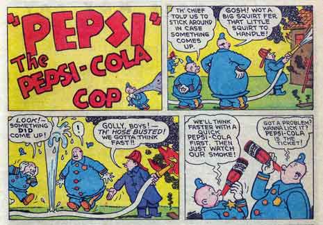

Steven Bradley (re)considers the current situation regarding [advertising within the responsive web design](http://www.vanseodesign.com/web-design/responsive-advertising/) movement.

A lot has changed and discussed in the last year surrounding this topic so it's worth reviewing some of the potential options. The general consensus comes down to advertising networks and suppliers adapting to the market - without them playing ball, nothing will change.

I like the idea of page sponsorships - a contextual model that applies to all situations yet offers much more flexible solutions regarding appearance.

It will be interesting to see if there is much progress over the coming months/years. Something has to change now responsive web design is becoming the standard.
