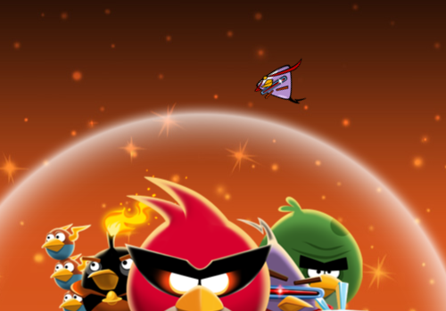

Love this promotional site for Angry Birds Space. As you scroll, the bird directs you around the content using similar motions from the game. It even senses the scroll motion and changes the orientation of the bird accordingly.

The game is fantastic too. Having played it for a month or so, I love the additional game mechanics introduced where you have to take into consideration extra factors.

Available on the [App Store](http://clk.tradedoubler.com/click?p=23708&a=1254950&url=http%3A%2F%2Fitunes.apple.com%2Fgb%2Fapp%2Fangry-birds-space%2Fid499511971%3Fmt%3D8%26uo%3D4%26partnerId%3D2003).
