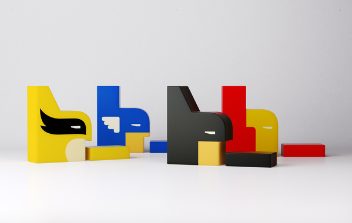

[BEM](https://github.com/bem) [commissioned Flëve](http://www.behance.net/gallery/BEM/4394265) to design an astonishing new identity for their development platform, currently in use by several big names including Russia's biggest search provider Yandex.

By extracting the B\_ from the name, the solution is extremely simple yet versatile allowing a range of opportunities for tailoring to different contexts (the comic characters are a brilliant example targeting the geek comic fans).

As any design agency should, they've covered all bases with samples applied to presentations, merchandise, even iOS icons.
