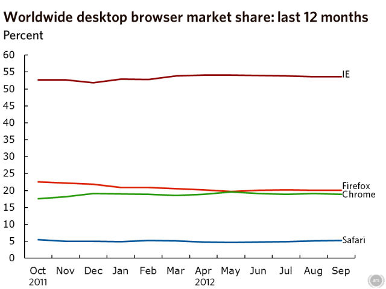

Recent statistics suggests [browser market share has flatlined](http://arstechnica.com/information-technology/2012/10/peak-chrome-googles-browser-falls-as-firefox-internet-explorer-stay-flat/) for the last year.

Whilst Chrome and Firefox have switched place in popularity in recent months, Internet Explorer has clearly dominated the war with very little change, suggesting the masses still don't get all the fuss over browser wars.

The rapid release model of Firefox and Chrome shows promising penetration yet these users typically understand the differences and show loyalties to their favourite vendors.

It begs the question whether the launch of IE10 along with Windows 8 will buck these trends. Now that Google and Microsoft are actively promoting their browsers with high impact TV and cinema adverts, it certainly shows the war hasn't ended.
