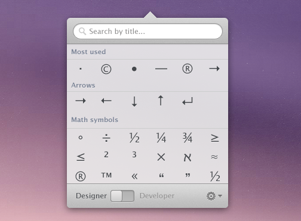

[Characters](http://getcharacters.com/) is a really handy little Mac app by Gustavs Cirulis ([@gustavscirulis](http://twitter.com/gustavscirulis)) for designers and developers to quickly access special characters.

The app sits in your menubar waiting for quick searches of the special characters often required for websites. By switching between designer and developer mode, it automatically copes the character or HTML entity code accordingly to your clipboard.

Another one of those great ideas well executed "“ and only £2/$3.

Update: Steve Marshall quite rightly [points out](https://twitter.com/SteveMarshall/status/228155141851844609) the native Special Characters tool in OS X is available from the keyboard shortcut ⌘⌥+T as well as under _Edit > Special Characters_. That said, Characters app certainly improves on that functionality and user interface.
