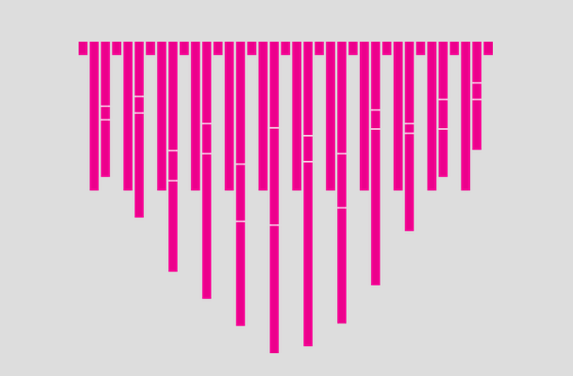

The [Data Necklace](http://datanecklace.com/) is an innovative idea by "hacker" [Stef Lewandowski](http://stef.io) creating data visualisations as jewellery.

The necklace is laser-cut, laser-etched acrylic that displays tweets from a given account or search query. The original concept was conceived on Scotland's Island of Eigg and was recently showcased at an exhibition at White Chapel Gallery in London.

I love ideas like these. Stef is constantly pushing the boundaries of digital, regularly hacking together data into nifty visualisations. I really hope the Data Necklace succeeds the [IndieGo campaign](http://www.indiegogo.com/datanecklace).
