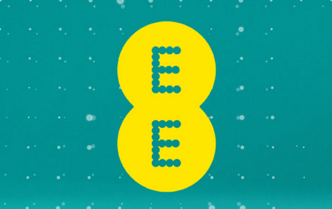

EE (formerly known as Everything Everywhere) launched a brand [new website and identity](http://ee.co.uk/)  today to promote them being at the forefront of the UK's new 4G network.

Having recently partnered Orange and T-Mobile into a unified network, EE are now focusing on the emerging 4th generation mobile network which should\* offer super-fast mobile network speeds.

What caught my attention with this is the new identity and accompanying website. The use of circles to create the logo mark have connotations with the fibre optics and global nature for connecting people. Whether this will replace Orange and T-Mobile's current branding is yet to be known or seen but the unique branding will help build a respectable profile for the new organisation.

The strong use of photography along with a friendly tone of voice make the website feel friendly with a human connection, something I always thought Orange did well as a brand. It's reassuring to see this consistency as the group move forward.

Obviously, time will tell how EE develop along with the 4G network and their online identity but this is a good first step. As an existing Orange customer, I have an invested interest so let's hope it's the start of something special.

\* I say with baited breath as our village still doesn't even have a reliable 2G network.
