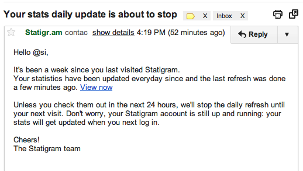

I just received an email from [Statigram](http://statigr.am/) "“ a third party [Instagram](http://instagram.com) app for presenting user behaviour statistics "“ to inform me that my profile data will no longer be updated on a daily basis as I haven't visited the site for a week.

This is a clever approach to incentivising return visitors.

Rather than let the user's account lapse or even ignore their existence, a subtle reminder to indicate the service has been running for the last week, waiting for your return, suggests the service is not forcing you to do anything. It is, however, bringing to your attention the data won't be updated as frequently until you do return.

Have you seen similar friendly emails attracting users back to a service?
