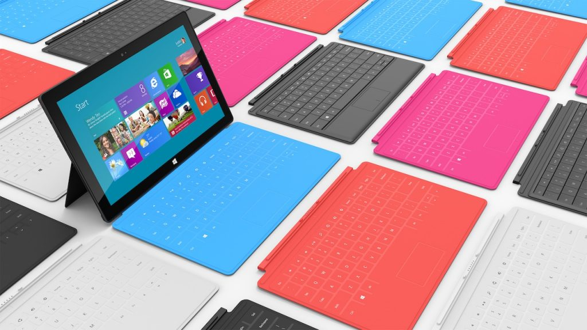

This week's Industry Insight (on the lovely redesigned Creative Bloq) focuses on the unveiling of the [Microsoft Surface](http://www.microsoft.com/surface) tablet.

Among several others, I had some thoughts on the device and what it means for the industry:

> On face value, Surface looks like healthy competition in a relatively monopolised market drowned in iPads (and, some might argue, Galaxys). They seem to have 'borrowed' a number of winning features from existing devices but put their own spin on them, with a soft keyboard and USB adaptor.
> 
> From a design point-of-view, the 16:9 widescreen could throw up some hurdles in web design, further evidence the responsive approach is the way forward. They just need to make sure the cost is competitive and launch is soon.

Read what the others had to say in [Industry Insight: Microsoft Unveils The Surface](http://www.creativebloq.com/industry-trends/industry-insight-microsoft-unveils-its-surface-tablet-612319).
