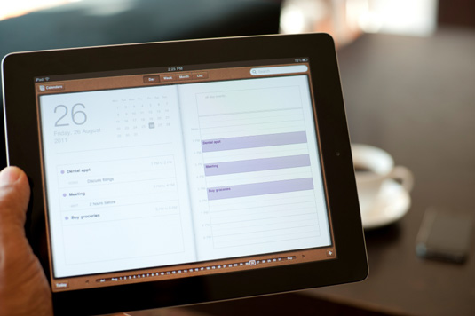

\[caption id="attachment\_388" align="alignnone" width="535"\] Skeuomorphic design of Calendar app in iOS\[/caption\]

In this week's Creative Bloq Industry Insight, a few of us have discussed Apple's use of skeuomorphic design in iOS. I've got mixed feelings:

> I'm in two minds about the direction iOS has evolved since it's initial inception.
> 
> On the one side, Apple are trying to reassure users that the tangible gestures relate to real world interactions, therefore reinforcing the user interface with relevantly designed materials (such as the mock leather bind of Reminders app or the felt table cloth of the Game Center).
> 
> On the flip side, the execution seems poor at times and it causes psychological conflict where some elements are forced into untypical situations.
> 
> Call me old fashioned but I like my apps to feel like apps and my notepads to feel like notepads.

See what the others have to say in [INDUSTRY INSIGHT: Designers comment on the iOS UI](http://www.creativebloq.com/design/industry-insight-designers-comment-ios-ui-712433).
