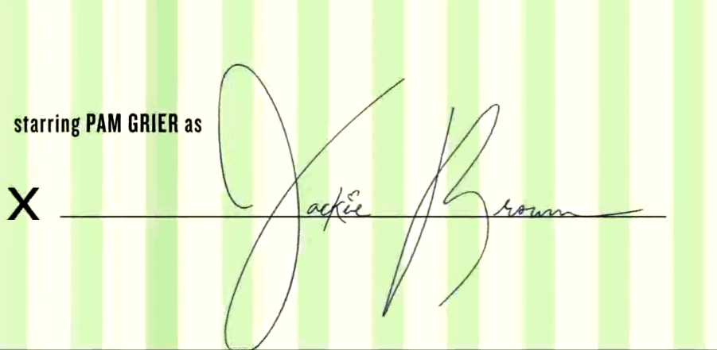

Creative Bloq recently asked me for some thoughts on inspiring movie title sequences.

First up, my thoughts on Quentin Tarantino's Jackie Brown;

> Following Resevoir Dogs and Pulp Fiction, Tarantino set the bar high but introduces this stylish 70s setting with a sublime storyboard on a flight ticket. By sending the audience on a journey around a single poster with applicable typography and motion, it's a fantastic example of setting tone with a simple idea. One of my all-time favourite movies. Love it.

Returning to my childhood memories, I then focused on Disney's 101 Dalmations;

> Disney title sequences have always had incredible attention to detail – a convention that goes right back to the early days of the animation studio. 101 Dalmatians is a prime example of this. The aesthetics of the title sequence are typical of 1961. The retro feel of the typography and illustration, the way the score of the soundtrack audibly matches the animation motion – it really engages with the audience. It makes typically boring credits exciting, especially with the mood of the music.

See what other designers had to say about [20 amazing movie title sequences to inspire you](http://www.creativebloq.com/design/top-movie-title-sequences-10121014).
