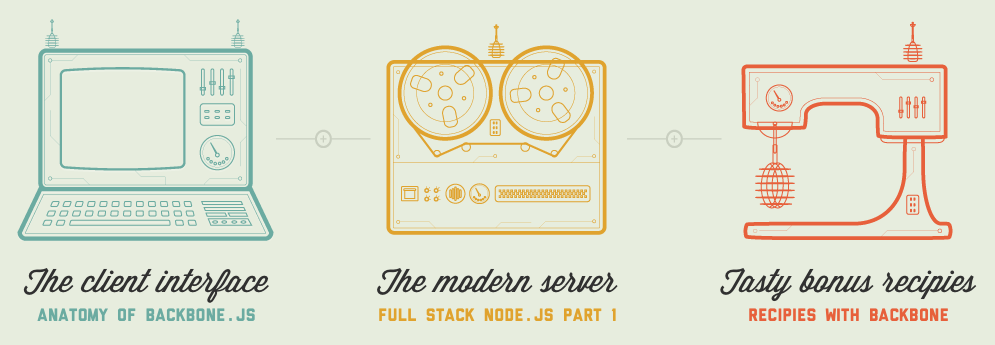

Javascript certainly has come a long way since Brendan Eich's original conception back in 1995. People like Douglas Crockford and John Resig have pioneered development throughout the years to which it's now possible to develop server-side applications with frameworks based on Javascript such as Backbone.js and Node.js.

For those who are keen to indulge in these new technologies, Coderwall have collaboated with Code School and PeepCode to offer a fantastic educational bundle called [Futureal](https://coderwall.com/futureal) including interactive courses, screencasts and eBooks.

The best part is you only pay what you want for it (starting from $20) plus 20% of all proceeds go towards the Women In Tech initiative, a worthy organisation trying to break the gender divide in technology.
