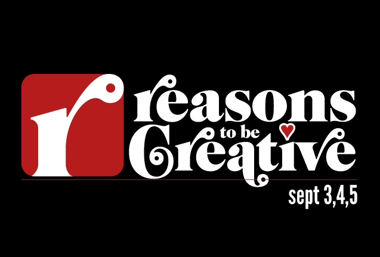

[Reasons to be Creative](http://www.reasonstobecreative.com/) – a 3-day conference in Brighton – has one the most impressive speaker line-ups I've seen for a while.

It's fantastic to see a healthy split between male and female speakers and from such a diverse background of topics as well.

The event has evolved hugely since it's original inception as "Flash on the Beach" back in 2006 and coincides well with the popular [dConstruct](http://2012.dconstruct.org/) event at the end of the week.
