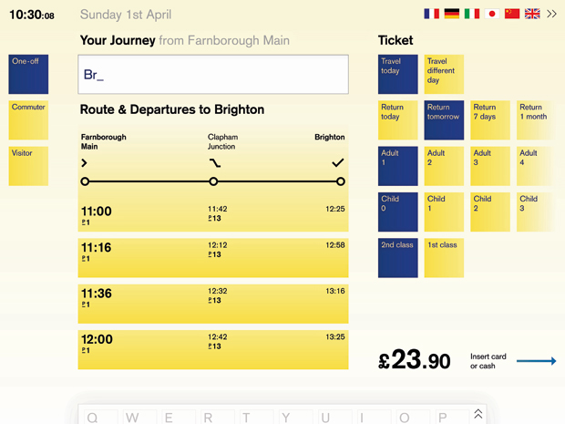

I like this effort at redesigning the ticket vending user experience at UK railway stations (a project I also attempted during my university years).

The quick search and clearly laid out content for journeys certainly minimise the number of steps users have to go through with faster responses (akin to Google Instant Search). However, the ticket options could have been better grouped, possibly separating travel dates, passengers and ticket types.

These sort of exercises are inspiring though; they make you think about the user experience in a structured manner. By publishing them online, others can learn from them too.

[Rethink: Ticket Vending Interface](http://www.iconeye.com/news/news/rethink-ticket-vending-interface)
