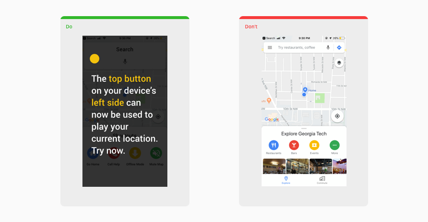

I like the idea of using device buttons rather than screen hot-spots for making mobile maps more accessible – it applies to so many scenarios, not just the visually impaired (think driving)

Source: _[Design Accessible Maps| Phase](https://phase.com/magazine/design-accessible-maps/)_
