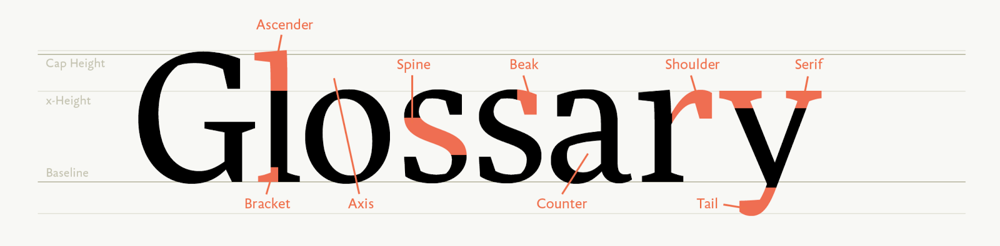

Weston Thayer has gathered together some brilliant insights to the structure of font files with all the information available about a typeface.

I encourage designers and developers alike to understand what it all means.

_🔗_ [Intro to Font Metrics](http://westonthayer.com/writing/intro-to-font-metrics/)
