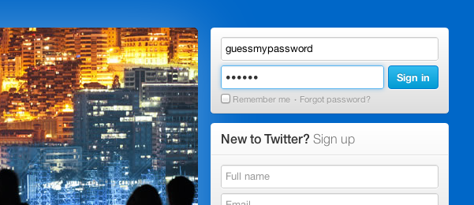

According to leaked data, there's an alarming trend in the [top three passwords](http://www.lukew.com/ff/entry.asp?1590&utm_source=feedburner&utm_medium=feed&utm_campaign=Feed%3A+WebFormDesign+%28Web+Form+Design%29&utm_content=Google+Reader) of popular sites.

On Twitter, the most common passwords of 58,000 leaked accounts were 123456, 123456789 and 102030.

From 450,000 leaked Yahoo! passwords, the top 3 were 123456, password and welcome.

From 4.6m leaked Linkedin accounts, the top 3 passwords were link, 1234 and work.

It's quite concerning that so few people take password security so seriously. With [Dropbox's recent security compromise](http://blog.dropbox.com/index.php/security-update-new-features/) and a growing number of leaks, people should treat their online identity with more discretion and either select more secure passwords or use a dedicated application like [1Password](https://agilebits.com/onepassword).

Alternatively, browsers and/or operating systems should educate users. Would it be so hard for vendors to prompt users with weak or identical passwords from other websites (especially when many browsers preserve that data)?
