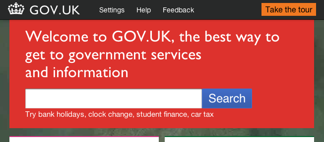

Last week, the new [GOV.UK](http://gov.uk) website was unveiled to the public.

Released as an early beta product, it is still very early days but my initial reactions are impressive. Unless you're aware, gov.uk is intended to centralise the vast number of UK government websites into a single solution, allowing the general public to quickly access important data without jumping through all the typical hoops.

As part of the project, I've been monitoring the development of the project by following certain individuals of the team on Twitter, including [Paul Annett](http://twitter.com/nicepaul), [Relly Annett-Baker](http://twitter.com/RellyAB), [Frances Berriman](http://twitter.com/phae) and [Gareth Rushgrove](http://twitter.com/garethr) (to name a few). Each of these guys bring unique talents to the table where Paul is a brilliant UI designer, Relly a fantastic knack for writing web copy, Frances as an evangelist of semantic markup and Gareth's impressive coding brain.

What has really caught my attention is the open nature of the entire project. They have been keen to embrace the open source culture of the Web, actively [blogging the design process](http://digital.cabinetoffice.gov.uk/) the team have gone through, creating discussion around design decisions as well as leveraging the power of popular online tools. They have published a vast amount of their development on [Github](https://github.com/alphagov) to allow other governments to reuse all the code they have created, as well as manage feedback such as feature requests and bugs on [Get Satisfaction](http://getsatisfaction.com/govuk).

It's quite exciting to see the evolution of the online presence of the UK Government with pioneers of the Web community, especially with such an open approach. Whilst it's only early stages, the results so far have been very promising. It's a fantastic opportunity to have such a large platform for promoting open source culture.
