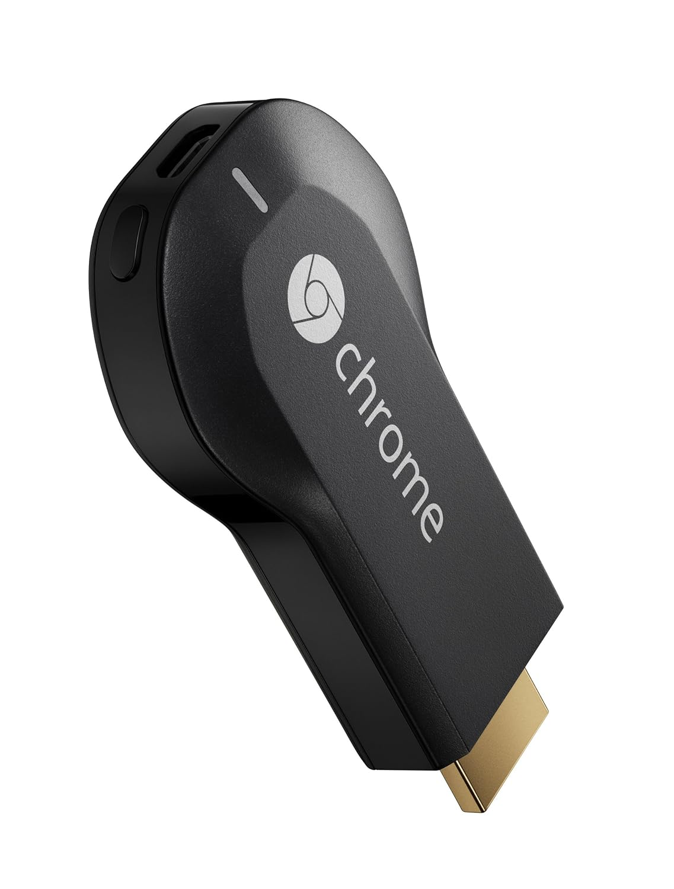

Last week, I was looking for ways I could watch [Netflix](http://www.netflix.com/) on my home TV.

My [Sony Network Media Player](http://www.sony.co.uk/hub/network-media-player) supports a range of content providers including LoveFILM Amazon Prime Instant Video but, for some reason or other, Netflix isn't available on the device in the UK (it is in the US though).

Hunting around, [Apple TV](http://www.apple.com/uk/appletv/) seemed like the logical move but I was cautious of the £100(ish) price tag, especially with the lack of decent UK content providers available.

Then I discovered the [Google Chromecast](http://www.google.co.uk/intl/en_uk/chrome/devices/chromecast/).

For just £30, you technically get an identical product but with additional features.

Whereas the Apple TV can seamlessly stream content directly from your iOS devices, the Chromecast bypasses your device when you "stream" published media, instead connecting directly with the original source. Your device is not acting as a proxy any more - merely a user interface, like a "smart TV remote" if you will. This has a number of benefits such as reducing local bandwidth and battery drain plus the convenience of picking up any devices to hand to control the content.

A number of content providers already support Chromecast. BBC iPlayer, Youtube and Netflix are the big ones for me but this is growing quickly as more and more distributors are discovering the power (and demand) for the device.

[Plex](https://plex.tv/features) has also released updates and [apps](https://itunes.apple.com/us/app/plex/id383457673?mt=8) to work alongside the Chromecast. This means I can stream locally stored media directly from the network drive via my iMac. No latency between the mobile devices controlling it too.

Due to the size of the device, it's not self powered. The included mini-USB cable can be looped into any USB points you have on your TV plus it also comes with a mains adaptor if it doesn't.

Setup was ridiculously simple. Just install an app on your PC or Mac, connect it to the local wifi, authenticate and you're pretty much done.

You don't need to install any apps on your devices either - supported apps just find the device on your local network and offer the facility to cast the content seamlessly. Anyone with a mobile and supported apps on your network can take control.

It's safe to say I'm a fan. I expect things will only get better with time too. Just go buy one.
