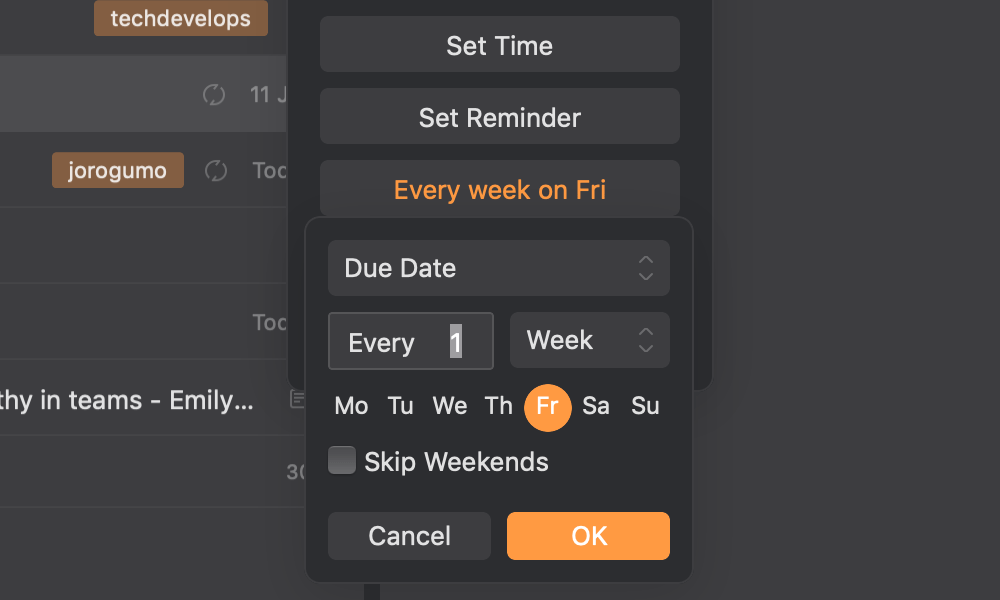
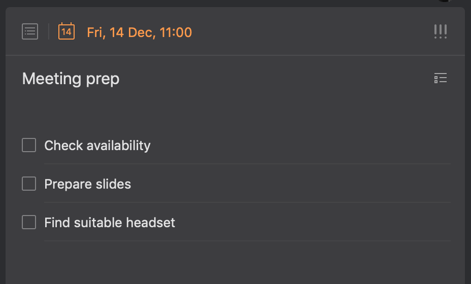
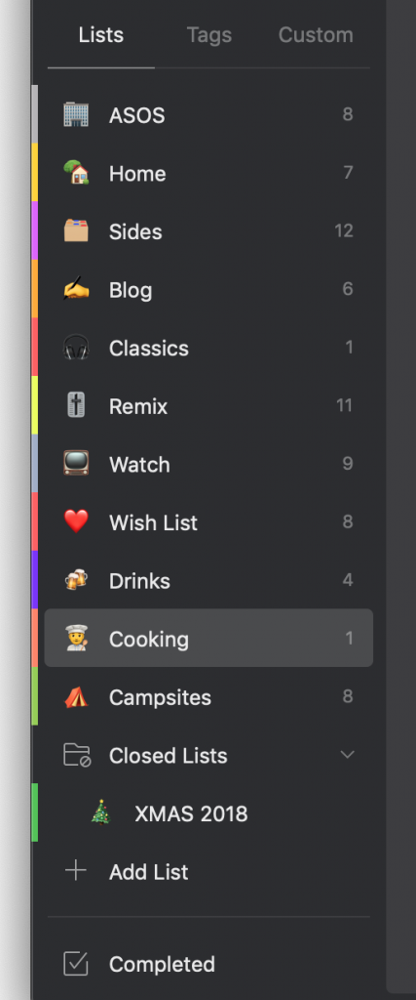

TickTick is my new favourite productivity app for Getting Things Done™. Let me explain why and how I’ve made it part of my every day habit.

There’s no shortage of GTD posts out there; I’ll spare you the spiel of the common problem people have. (If you fancy an audio ramble, you can always have a listen to [my rant with James Norton on GSD](h).)

As an engineering manager in a busy environment, I need my tool for managing tasks to be convenient, intuitive and organised. [TickTick](https://ticktick.com/zFVY6?u=d329b4da060741dbadd960e21150f1f2) _ticks_ all the boxes (pun intended) and continues to be updated regularly with subtle but useful features,.

## Why is TickTick any different?

In short, it’s not that different from iOS Reminders on the face of it; multi-device support, iCloud (background) sync, lists for grouping, time-based reminders… it’s not going to win many awards for innovation there - but it has got plenty potential with the extra features though.

First off, items can be repeated. This is a big win for me when I have regular things to do – updating stakeholders, weekly or monthly tasks like timesheets, fortnightly 121s. Setting the frequency is pretty versatile to suit your needs and it even tries to use natural language when you’re creating items (think “Check timesheets last Friday of the month” or “Team video-call every weekday morning at 9.30”).

<figure>

<figcaption>

Custom repeat iterations on tasks

</figcaption>

</figure>

Secondly, it’s possible to create nested actions with sub-items. For example, say you’ve got to prepare for a meeting in a few days time, it’s possible to break down the actions like “Check availability”, “Prepare slides” and “Find suitable headset” within a top-level “Weekly Meeting” item. (The UI even shows a subtle progress meter in the background of the parent item on your main list - nice touch).

<figure>

<figcaption>

Nested actions within items

</figcaption>

</figure>

Thirdly, items can be annotated in so many different ways. You can use hashtags to group items by tags, record timestamped comments on individual items rather than filling out the description, even record Pomodoro timers against items for time management.

<figure>

<figcaption>

Tags, attachments, comments and activities on tasks

</figcaption>

</figure>

## Beauty is in the eye of the beholder

There’s plenty of subtle (and untouched) features in [TickTick](https://ticktick.com/zFVY6?u=d329b4da060741dbadd960e21150f1f2) that make it such a joy to use as well, especially when you upgrade to the Premium subscription:

- Prefix list names with a suitable emoji and that replaces the default icon
- Colour-coded lists visually highlight your items in the main, detail and calendar view
- Drag-and-drop ranking allows you to easily order your items in any of the views
- Dark mode (and many other themes) make for a very personal experience across your devices
- Offline updates are automatically synchronised seamlessly - ideal for someone who plans their day or week commuting to work with patchy / limited data connectivity (like me)
- You can set your preferred reminder time for the day, so whether your working day starts at 8am (like me) or 10am (like most engineers), it’s appropriately timed

<figure>

<figcaption>

List names with emojis

</figcaption>

</figure>

After just a few months, I’ve barely scratched the surface what [TickTick](https://ticktick.com/zFVY6?u=d329b4da060741dbadd960e21150f1f2) is capable of and every time I start delving deeper, I find another little treat that makes it even more of a delight to use. The developers behind the app are clearly power users (global Cmd+Shift+A across macOS is hugely helpful) and have tapped into requirements that other todo apps have overlooked, making a concerted effort to create the most simple and elegant experience as possible.

For now, I will be continuing my [Premium subscription](https://ticktick.com/about/upgrade) and I encourage anyone else looking for a simple but flexible todo app across the Apple ecosystem to seriously consider [TickTick](https://ticktick.com/zFVY6?u=d329b4da060741dbadd960e21150f1f2).

[TickTick](https://ticktick.com/zFVY6?u=d329b4da060741dbadd960e21150f1f2) is available on the App Store for [macOS](https://itunes.apple.com/gb/app/ticktick-things-tasks-to-do/id966085870?mt=12) and [iOS](https://itunes.apple.com/us/app/ticktick-things-tasks-to-do/id626144601?mt=8)  plus [Play Store](https://play.google.com/store/apps/details?id=com.ticktick.task&hl=en_GB) for Android (if you're that way inclined).
