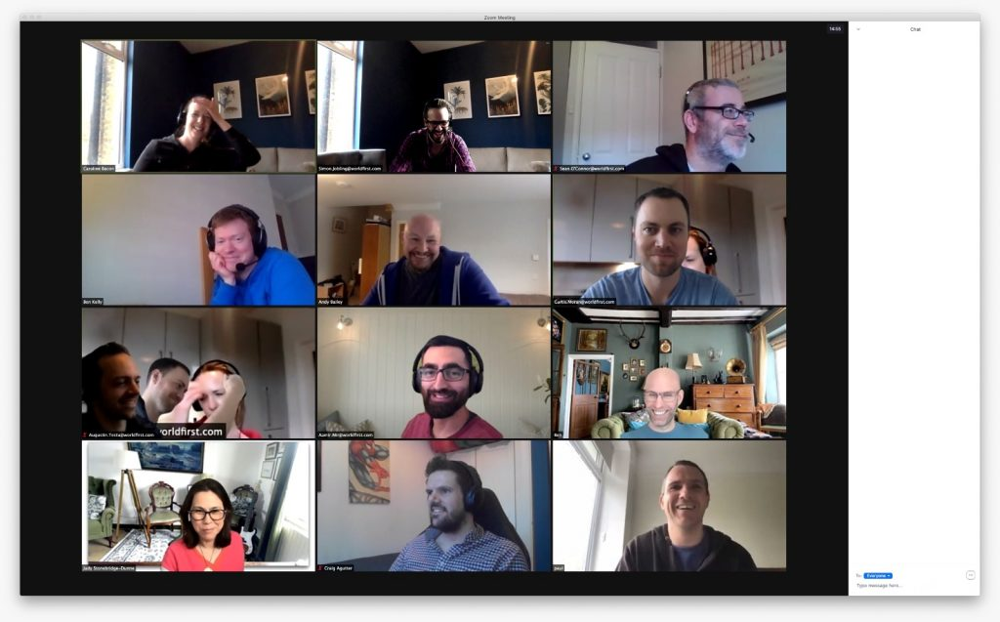

_In a month when I change jobs, release two podcast series and get zero fitness._

## Goodbye Ant, Hello ASOS

As mentioned last month, I've accepted an Engineering Manager role back at ASOS following 14 months working at Ant Group's WorldFirst as Delivery Lead.

March has mostly been about wrapping up handover and preparing peers to take on some of my responsibilities (due to delays replacing me). A couple projects have upcoming deadlines looming but everything seems to be in hand with minimal concerns about timelines - quite satisfying to be in such a promising position to suggest my efforts have provided the desired results. Naturally there are a couple loose ends but nothing that couldn't be handled.

<figure>

<figcaption>

Leaving drinks in Zoom

</figcaption>

</figure>

Having witnessed a couple other leavers experiences over the past few months, I was keen to avoid the embarrassing "surprise" Zoom call and awkwardly long silences/gaps in conversations so joined forces with a fellow leaver to arrange 4pm Friday virtual drinks with a select bunch of colleagues and peers. We also prepared a few icebreaker questions to encourage (silly) conversations continued as naturally as possible. (Pro tip: Richard Herring's Emergency Questions provide plenty inspiration but aren't necessarily SFW – use with caution)

As I sent my leaving message to team mates, I decided to mark the moment with an impromptu Linkedin post thanking my WorldFirst peers and preparing for the ASOS crowd. Little did I realise how "viral" that post would turn out; as of writing this, it had over 9,000 impressions and 130 reactions. A combination of well-tagged company and people names and timing might have helped but definitely worth considering Linkedin for any social marketing based on this evidence.

<figure>

<figcaption>

9K impressions on Linkedin

</figcaption>

</figure>

I'm now two days in to the ASOS role which has been quite a humbling experience - plenty people have welcomed me back plus the new faces have been very welcoming. I'm still finding my feet in a new team, business domain and new responsibilities but early signs are promising.

## Season 5 is a wrap

Last week, we wrapped up [Season 5 of the Make Life Work podcast On The Side takeover](https://makelifeworkpodcast.com/tag/season-5/). I've loved recording this series alongside Sam and Mike as I think we've found a really good format we can work with. Whilst Mike finds a new groove with his pending arrival and I get comfortable in my new role, we're taking a short break but will likely return to the format in May with a number of new guests. Shout out to [Shari](https://makelifeworkpodcast.com/selfish-problem-solving/), [Juan](https://makelifeworkpodcast.com/tingle-of-completion/) and [Jesse](https://makelifeworkpodcast.com/what-is-a-side-project-if-not-a-safe-place-to-get-imposter-syndrome/) for joining us on the podcast too - 3 wonderful guests who added some additional angles in the conversations.

It wasn't the only podcast I worked on in March - [Spring Break '21](https://www.housefinesse.com/shows/house-finesse-89-spring-break-2021/) was released last week on the House Finesse podcast too. As we approach the 16th year of the podcast, it's amazing to think how far the podcast has come and continued to provide a semi-regular dose of uplifting house music to our loyal followers. I've changed the direction with the artwork a little as well but it's all about the music and it's great to monitor the download counts to see how shows compare. We're also exploring how to inject some new life into the podcast with some additional guest mixes - it'll be great to extend the team roster to other talent so conversations have began and we hope to make it a monthly thing.

As I finished my time with WorldFirst, I decided to conclude the regular time journal records until I've got a more stable rhythm at ASOS (a 3-day week followed by week holiday will really skew numbers). I also want to re-evaluate the trends and insights before I get back into it to make sure it actually surfaces useful information. I'll be going through it with some friends and peers to see what they make of it (Jesse was definitely curious and [Max](https://twitter.com/maxray/status/1364328614024667141) has been trying it out as well).

Finally, I've also started the process to become a non-standing candidate for the Green Party in our Braunston & Crick ward. With the local elections approaching in May, I want to provide our local constituents an opportunity to vote green in a predominantly Conservative/LibDem strong-hold. Chances are slim of any traction but it's all about improving coverage in the local elections to make sure people realise Green Party are a serious alternative. I'll be looking into compiling and publishing my thoughts over the coming weeks along with asking local electors what green issues matter to them.

## Fitness On Hold

Having struggled with my feet after a 10km run for Endometriosis UK #1in10 campaign, I went to a local podiatrist who assessed my feet and gait. He confirmed I have flat feet which required treatment and in-soles so, following a second opinion with another private clinic, I'm now waiting for custom orthotics to be moulded whilst I've started regular rehabilitation therapy from home. It's put all fitness and exercise on hold until I'm more comfortable (frustrating when I wanted to raise funds and awareness for Endo UK), but I will recommence efforts later in the year when it's safe to do so.

## AOB

- Princess was [featured in our local newspaper](https://www.daventryexpress.co.uk/lifestyle/family-and-parenting/crick-girl-puts-on-her-bunny-ears-and-delivers-150-easter-gifts-to-her-neighbours-3183751) following a thoughtful effort delivering Easter eggs to our village neighbours
- Our [Multipack branded t-shirts](https://unstyled.com/product-tag/multipack/) finally [turned up last week](https://www.instagram.com/p/CMzXX-WJ_mG/?igshid=10iwrxr01mfjo) – many satisfied customers (albeit some typical QA feedback from Paul)
- Following advice from Matt, we've setup a [House Finesse Discord](https://www.housefinesse.com/community/) to try and get the community together
- I've tried to capture [my tweets in a localised archive](http://sijobling.com/tweet/) with mixed results - something that needs further attention
- It looks like [the majority of my Twitter followers have blogged this year](https://twitter.com/Si/status/1372638165169758212?s=20) although quite a large group haven't
- Having said that, I wrote a rare blog post about [things we can learn from playing LEGO with a 8 year old](http://sijobling.com/blog/what-we-can-all-learn-from-playing-lego-with-an-8-year-old/)
- I also setup a new Apple HomePod in the kitchen for a fuller sound when listening to music - definitely a huge improvement on sound quality but voice commands definitely aren't as versatile as Alexa (especially syncing reminders with [my preferred Ticktick](https://ticktick.com/r?c=dro4kuok)).
