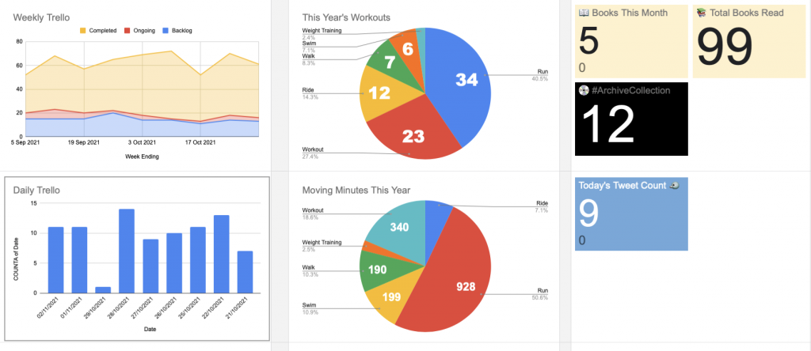

_Busy month of birthdays and parties, communities of practice, hacking for sustainable fashion, concluding Make Life Work S07, another House Finesse mix compilation and celebrating Black History Month with DJ Programma guest mix and some recommended short stories._

## Work

- Started capturing a personal weekly retro, rating key factors out of 10 (e.g. productivity, stress, learning), noting top 3-5 highlights, frustrations and lessons learnt
- Went to the London office twice and Birmingham twice
- Started work on an in-house tech podcast with the first pilot hybrid recording and creating a community of practice to support
- Created mini COPs across the EM community based on joint initiatives including **Diversity, Equity & Inclusivity** (DEI), **Emerging Talent**, **Tech Brand** and **Vibe Survey Feedback**
- Co-hosted a multi-team platform day in London to discuss roadmaps and ways of working for the coming quarters
- Only the one Lightning Talk this month from Alastair on making web apps with Blaze
- Enjoyed Rudimental, Horse Meat Disco and plenty impromptu friendly chats at the big Reassembles party at Alexandra Palace
- Participated in (and won!) a "_Fashion With Integrity_" sustainability hackathon with Kim, Millie, Tia and Sashi

## Life

- Weekend in Preston & Blackpool for Mrs J ‘s birthday, visiting Madame Tussaud’s, the Dungeons and Tower
- Met up with old uni chums Lisa, Phil (and kids) for some Sunday lunch in Chester
- Impressed with The Boy signing up to local RAF Air Cadets and taekwondo club - trained ninja in the making
- Trapp’d panic room and Jurassic Grill in Kettering for The Boy’s birthday
- 9 workouts over 4h26m

## Sides

- Concluded Make Life Work S07 with [Silvia & Ely](https://makelifeworkpodcast.com/making-candles-silvia-ely/) and [Mubashar Iqbal](https://makelifeworkpodcast.com/making-founderpath-with-mubs/)
- Released the quarterly [House Finesse Halloween ‘21](https://www.housefinesse.com/shows/house-finesse-99-halloween-2021/) mix compilation
- Featured 2 guests on House Finesse; [Anna C](https://www.housefinesse.com/finessefriday/featuring-anna-cee/) and [DJ Programma](https://www.housefinesse.com/djprogramma)
- Analysed [On The Side](http://ontheside.network/) engagement following some quiet months that, thankfully, picked up over recent weeks
- Extended my _Personal Dashboard_ with financial analysis (spend breakdown, pension and shares tracking), podcast downloads and social account engagement metrics  
    

<figure>

<figcaption>

Weekly & Daily Trello charts, annual Strava splits, Goodreads month & year, #ArchiveCollection and tweet count

</figcaption>

</figure>

## Watched 📺

- **Squid Game** on Netflix (with the rest of the world)
- [Pose](https://www.bbc.co.uk/programmes/m0003g1h) on BBC iPlayer
- **Brassic S03** on NowTV
- **Stath Lets Flats S03** on All4
- **No Time To Die** at Cineworld

## Read 📚

- [Genome (The Extinction Files, #2)](https://www.goodreads.com/review/show/4277823701?utm_medium=api&utm_source=rss) by A.G. Riddle
- [The Visit (Black Stars #1)](https://www.goodreads.com/review/show/4280885238?utm_medium=api&utm_source=rss) by Chimamanda Ngozi Adichie
- [These Alien Skies (Black Stars #4)](https://www.goodreads.com/review/show/4284206902?utm_medium=api&utm_source=rss) by C.T. Rwizi
- [2043…A Merman I Should Turn to Be (Black Stars #3)](https://www.goodreads.com/review/show/4285876563?utm_medium=api&utm_source=rss) by Nisi Shawl
- [Pandemic (The Extinction Files, #1)](https://www.goodreads.com/review/show/4289194445?utm_medium=api&utm_source=rss) by A.G. Riddle

## Listened 🎧

1. [#FinesseFriday - Featuring… Amy Lauren](http://feedproxy.google.com/~r/onephatdj/~3/j1oLSqetC-4/) on [House Finesse](http://feeds.feedburner.com/onephatdj)
2. [#FinesseFriday - Featuring… Anna Cee](http://feedproxy.google.com/~r/onephatdj/~3/gEn_zLrGnh0/) on [House Finesse](http://feeds.feedburner.com/onephatdj)
3. [Glitterbox Radio Show 235: Presented by Melvo Baptiste](http://www.defected.com/) on [Defected Radio](https://portal-api.thisisdistorted.com/xml/defected-in-the-house)
4. [S03 EP24: Lucy Beaumont (The Return)](https://www.spreaker.com/user/12633137/parenting-hell-lucy-beaumont-mm-e) on [Rob Beckett and Josh Widdicombe's Parenting Hell](https://podcast.global.com/show/4467866/episodes/feed)
5. [Ep 122: Meera Syal](https://play.acast.com/s/offmenu/ep122-meerasyal) on [Off Menu with Ed Gamble and James Acaster](https://rss.acast.com/offmenu)
6. [Making candles with Silvia and Ely](https://makelifeworkpodcast.com/making-candles-silvia-ely/) on [Make Life Work](https://makelifeworkpodcast.com/feed/podcast/)
7. [#226 - How to Be Your Own VC with James Layfield of Clearfind](https://share.transistor.fm/s/5b85efeb) on [Indie Hackers](https://feeds.transistor.fm/the-indie-hackers-podcast)
8. [Defected Radio 24.09.21 with Monki](http://www.defected.com/) on [Defected Radio](https://portal-api.thisisdistorted.com/xml/defected-in-the-house)
9. [S12, Ep 5 How to Fail: Ruby Tandoh](https://howtofail.podbean.com/e/how-to-failruby-tandoh/) on [How To Fail With Elizabeth Day](https://howtofail.podbean.com/feed.xml)
10. [#HKR39/21Hedkandi Radio](https://hedkandi.libsyn.com/hkr3921hedkandi-radio) on [Hed Kandi Radio](https://hedkandi.libsyn.com/rss)
11. [Drenching Drizzle Disco Day](http://www.disco77.co.uk/?name=2021-10-02-Drenching_Drizzle_Disco_Day.mp3) on [The Disco, Funky and Soulful House Sessions](http://www.disco77.co.uk/new-feed.xml)
12. [Defected Radio 17.09.21 with Rimarkable](http://www.defected.com/) on [Defected Radio](https://portal-api.thisisdistorted.com/xml/defected-in-the-house)
13. [EP.163 - LAUREN PATTISON AND SAM LEE](https://play.acast.com/s/adambuxton/ep.163-laurenpattisonandsamlee-acast44e3166d) on [THE ADAM BUXTON PODCAST](http://rss.acast.com/adambuxton)
14. [S03 EP25: We're getting a dog, Josh!](https://www.spreaker.com/user/12633137/parenting-hell-1st-oct-final) on [Rob Beckett and Josh Widdicombe's Parenting Hell](https://podcast.global.com/show/4467866/episodes/feed)
15. [S03 EP26: Charlotte Church](https://www.spreaker.com/user/12633137/parenting-hell-charlotte-church) on [Rob Beckett and Josh Widdicombe's Parenting Hell](https://podcast.global.com/show/4467866/episodes/feed)
16. [Ep 123: Jeff Rosenstock](https://play.acast.com/s/offmenu/ep123-jeffrosenstock) on [Off Menu with Ed Gamble and James Acaster](https://rss.acast.com/offmenu)
17. [Ep 117: Ainsley Harriott](https://play.acast.com/s/offmenu/ep117-ainsleyharriott) on [Off Menu with Ed Gamble and James Acaster](https://rss.acast.com/offmenu)
18. [#HKR40/21Hedkandi Radio](https://hedkandi.libsyn.com/hkr4021hedkandi-radio) on [Hed Kandi Radio](https://hedkandi.libsyn.com/rss)
19. [Making Founderpath with Mubs](https://makelifeworkpodcast.com/making-founderpath-with-mubs/) on [Make Life Work](https://makelifeworkpodcast.com/feed/podcast/)
20. [RHLSTP 349 - Tim Key](https://play.acast.com/s/rhlstp/rhlstp349-timkey) on [RHLSTP with Richard Herring](http://rss.acast.com/rhlstp)
21. [Ep.45 Playstation Ready](http://idonthavetimetogameanymore.com/episodes/45-playstation-showcase) on [I Don't Have Time To Game Anymore](https://idonthavetimetogameanymore.com/podcasts/rss.php)
22. [Glitterbox Radio Show 237: Presented by Melvo Baptiste](http://www.defected.com/) on [Defected Radio](https://portal-api.thisisdistorted.com/xml/defected-in-the-house)
23. [Ep 137. Oh Crumbs](https://play.acast.com/s/sma/ep137.ohcrumbs) on [Sh\*\*ged Married Annoyed](https://rss.acast.com/sma)
24. [Ep 136. Elephant Dolphin](https://play.acast.com/s/sma/ep136.elephantdolphin) on [Sh\*\*ged Married Annoyed](https://rss.acast.com/sma)
25. [#230 - Grit, Timing, and Building Businesses You Love with Andrew Gazdecki of MicroAcquire](https://share.transistor.fm/s/a83ee5eb) on [Indie Hackers](https://feeds.transistor.fm/the-indie-hackers-podcast)
26. [Ep 135. Turbo time](https://play.acast.com/s/sma/ep135.-questionsfromthepublicspecial-) on [Sh\*\*ged Married Annoyed](https://rss.acast.com/sma)
27. [EP.164 - COLSON WHITEHEAD](https://play.acast.com/s/adambuxton/ep.164-colsonwhitehead) on [THE ADAM BUXTON PODCAST](http://rss.acast.com/adambuxton)
28. [S03 EP27: I hate my life...](https://www.spreaker.com/user/12633137/ph-tuesday-12th-october-final-1) on [Rob Beckett and Josh Widdicombe's Parenting Hell](https://podcast.global.com/show/4467866/episodes/feed)
29. [Ep 124: Michelle Keegan](https://play.acast.com/s/offmenu/ep124-michellekeegan) on [Off Menu with Ed Gamble and James Acaster](https://rss.acast.com/offmenu)
30. [4 To The Floor Show Ep 25 presented by Seamus Haji](http://www.defected.com/) on [Defected Radio](https://portal-api.thisisdistorted.com/xml/defected-in-the-house)
31. [S03 EP28: Michael McIntyre](https://www.spreaker.com/user/12633137/parenting-hell-michael-mcintyre-f) on [Rob Beckett and Josh Widdicombe's Parenting Hell](https://podcast.global.com/show/4467866/episodes/feed)
32. [Ep 138. Party at the drive thru](https://play.acast.com/s/sma/ep138.partyatthedrivethru) on [Sh\*\*ged Married Annoyed](https://rss.acast.com/sma)
33. [The Art of Growing Up: Using the Challenges of Leadership to Attain Radical Self-Inquiry (with Jerry Colonna, CEO of Reboot.io)](https://anchor.fm/fellowapp/episodes/The-Art-of-Growing-Up-Using-the-Challenges-of-Leadership-to-Attain-Radical-Self-Inquiry-with-Jerry-Colonna--CEO-of-Reboot-io-e18nl6a) on [Supermanagers](https://anchor.fm/s/1bec0d90/podcast/rss)
34. [S03 EP29: Faking a hamster's death...](https://www.spreaker.com/user/12633137/parenting-hell-tuesday-19th-octo) on [Rob Beckett and Josh Widdicombe's Parenting Hell](https://podcast.global.com/show/4467866/episodes/feed)
35. [#HKR42/21Hedkandi Radio](https://hedkandi.libsyn.com/hkr4221hedkandi-radio) on [Hed Kandi Radio](https://hedkandi.libsyn.com/rss)
36. [Kim Scott (Author of Radical Candor) on How to Get Sh\*t Done Fast and Fair in the Workplace](https://anchor.fm/fellowapp/episodes/Kim-Scott-Author-of-Radical-Candor-on-How-to-Get-Sht-Done-Fast-and-Fair-in-the-Workplace-e192o8h) on [Supermanagers](https://anchor.fm/s/1bec0d90/podcast/rss)
37. [EP.165 - DAVID SEDARIS](https://play.acast.com/s/adambuxton/ep.165-davidsedaris) on [THE ADAM BUXTON PODCAST](http://rss.acast.com/adambuxton)
38. [#FinesseFriday - Gweilo ADE16](http://feedproxy.google.com/~r/onephatdj/~3/iF2F13KbzQY/) on [House Finesse](http://feeds.feedburner.com/onephatdj)
39. [Glitterbox Radio Show 238: Presented by Melvo Baptiste](http://www.defected.com/) on [Defected Radio](https://portal-api.thisisdistorted.com/xml/defected-in-the-house)
40. [Retro RHLSTP 25 - Brett Goldstein](https://play.acast.com/s/rhlstp/retrorhlstp25-brettgoldstein) on [RHLSTP with Richard Herring](http://rss.acast.com/rhlstp)
41. [S03 EP30: Jessie Ware](https://www.spreaker.com/user/12633137/parenting-hell-jessie-ware-fina) on [Rob Beckett and Josh Widdicombe's Parenting Hell](https://podcast.global.com/show/4467866/episodes/feed)
42. [The October House Session 2021](http://www.disco77.co.uk/?name=2021-10-15-The_October_House_Session_2021.mp3) on [The Disco, Funky and Soulful House Sessions](http://www.disco77.co.uk/new-feed.xml)
43. [S03 EP31: Have you taken magic mushrooms?...](https://www.spreaker.com/user/12633137/parenting-hell-261021-final) on [Rob Beckett and Josh Widdicombe's Parenting Hell](https://podcast.global.com/show/4467866/episodes/feed)
44. [#FinesseFriday - Featuring… DJ Programma](http://feedproxy.google.com/~r/onephatdj/~3/J5VkDY52yTM/djprogramma) on [House Finesse](http://feeds.feedburner.com/onephatdj)
45. [#HKR43/21Hedkandi Radio](https://hedkandi.libsyn.com/hkr4321hedkandi-radio) on [Hed Kandi Radio](https://hedkandi.libsyn.com/rss)
46. [S03 EP32: Jimmy Carr](https://www.spreaker.com/user/12633137/parenting-hell-jimmy-carr-final) on [Rob Beckett and Josh Widdicombe's Parenting Hell](https://podcast.global.com/show/4467866/episodes/feed)
47. [House Finesse 99 - Halloween '21](http://feedproxy.google.com/~r/onephatdj/~3/4FwtQssKOU0/) on [House Finesse](http://feeds.feedburner.com/onephatdj)
