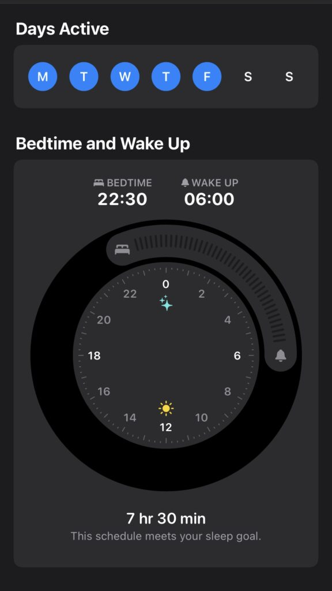
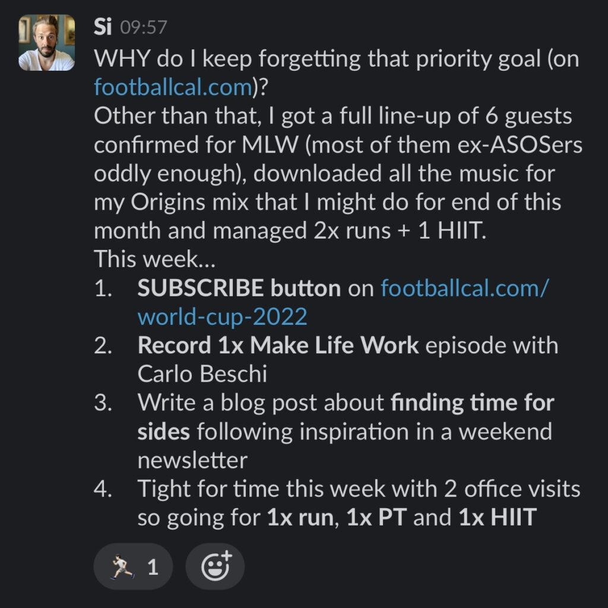
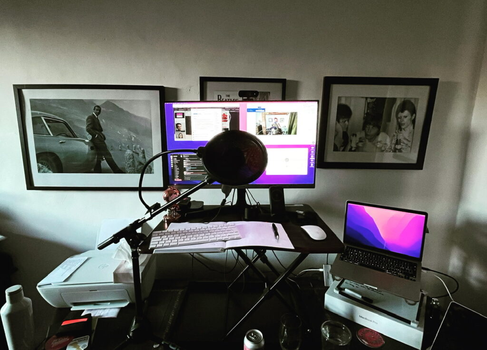

Before the pandemic, I used to get the train to London and back daily. Many would be surprised how much time I'd spend travelling to work but it actually provided me a couple hours of focus time - either reading, listening to podcasts or on side projects. 

When lockdown hit, all that changed. Many people utilised the extra home time with hobbies and their own side projects but I had to create pockets of time from newfound family commitments with homeschooling and housework taking priorities. This would typically be in the morning (before work) or evenings (after kids and wife went to bed). 

With lockdown restrictions easing and new office time expectations, I'm having to find a new balance between home and work commitments. I typically head to the office once a week now (mostly for social and mental health benefits) and often use the train time to focus on side projects, especially when most of it is now producing podcasts which actually benefit from no internet connectivity. 

I recently read an [interesting post on Indiehackers by Jasmina](https://click.convertkit-mail4.com/r8u2v8n022hoh22vxdpu2/dpheh0hqn4kq88sm/aHR0cHM6Ly93d3cuaW5kaWVoYWNrZXJzLmNvbS9qYXNtaW5hP3V0bV9zb3VyY2U9aW5kaWUtaGFja2Vycy1lbWFpbHMmdXRtX2NhbXBhaWduPWloLW5ld3NsZXR0ZXImdXRtX21lZGl1bT1lbWFpbA==) on some useful tips for finding time on side projects which many suggestions rang true for me. I thought it might benefit others to provide my customisations. 

## Batching activities

One suggestion by [Matt Trussell is batching](https://www.indiehackers.com/post/how-do-you-manage-to-work-on-side-projects-and-learn-new-stuff-while-working-full-time-3c9053055c?commentId=-N40VvKSIldipc9aT6mH&utm_campaign=ih-newsletter&utm_medium=email&utm_source=indie-hackers-emails). This could be with time blocks or even tasks.  

In 2021, I started a [time journal](%20https://docs.google.com/spreadsheets/d/1AFk2PXi8s5srf1NDSOJnytMAqlWB-H4IUOx8xv8hSB0/edit) as I was curious how I spent my days between work, family and personal activities with 30 minute units (think Pomodoro technique). It was quite a commitment in itself but with some regular reminders spread throughout the day, it provided some interesting insights over time. Within a week, I had identified patterns and opportunities to carve out for side projects but also allowing a reasonable balance with my family and enough down time. 

I also find it useful blocking activities together to minimise context switching.

- If I’m in **podcast mode**, I focus on [Make Life Work](http://makelife.work/) and [House Finesse](http://housefinesse.com/) together.
- If I’m in **devops mode**, I maintain updates and upgrades on the many sites I still maintain.
- If I’m in **admin mode**, it will be all the domain renewals and social media accounts I manage.

You get the idea. 

## Use your "commute" time

[Ivan Đurđevac](https://twitter.com/djuki?s=21&t=6gF5YqB2gVUyCq-nvDsnNw) advocates remote work, or searching for a job that is permanently remote. I have mixed feelings about this as whilst I can see the benefits of less travel time, the counter benefits of physical relationships in person and head space working in an office can dramatically improve mental health and wellbeing. 

As I mentioned before, by saving the offline time on a train for quality focus time, you can actually produce some great outputs without distractions. I tend to pencil my travel time for producing podcasts as (a) 45 minutes on a laptop with headphones typically creates about 15-20 minutes of content and (b) the limited internet connectivity of UK railways reduces online distractions. 

On the days I'm not travelling, I tend to find I'm most productive in the morning than evening (this has changed over time - back in my 20s before parenting took over, I'd often stay up beyond midnight to focus on my side projects). The family are often awake at 6am to prepare for schools so, once I've got my wife and kids sorted, I've got an hour or two before work. Many days I will just read my Kindle but it's also ample time to smash out some quality code or content. 

<figure>

<figcaption>

Bedtime schedule in iOS for 22:30-06:00

</figcaption>

</figure>

Whether you're a night owl or early bird, you need to be careful not to burn the candle at both ends. I typically get to bed by 11am with 6am starts - bedtime mode reminders on Apple Watch, iPhone and Mac are great at encouraging this but I’m not necessarily strict to the prompts (10pm notifications often get ignored). 

## Red lines set boundaries 

I like [Bruce Cullen](https://twitter.com/therealbrucec?s=21&t=lhsygWVIjf1bw0SfMN_-cw)'s "red lines" analogy to define limits. Like him, I have to set some priorities on what my commitments are and in specific priority order. Mine are:

1. Family
2. Work
3. Fitness & wellbeing
4. Side projects
5. Entertainment (reading, podcasts, TV)

Top 3 are mandatory then everything else is optional. Family commitments take top priority with work a close second. I set myself weekly fitness goals to ensure my body and mind are in a good place (which also lend toward quality family and work time) then all my side projects should flow around. I do value the importance of entertainment, especially relaxing with a book and cinema or TV with the family, but these things can be compromised if side project goals demand my focus and capacity. 

## Plan for the unplanned 

[Vincent Vrijburg takes the weather into account](https://www.indiehackers.com/post/how-do-you-manage-to-work-on-side-projects-and-learn-new-stuff-while-working-full-time-3c9053055c?commentId=-N42do9XK84tcsh3HAMH&utm_campaign=ih-newsletter&utm_medium=email&utm_source=indie-hackers-emails) when making short term plans. This also feeds into the above priorities. 

Every week, I set my week goals publicly in our [On The Side Slack community](http://ontheside.network/) based on personal, fitness and side projects needs. I also reflect on the previous week's goals to ensure I'm not over (or under) committing. Using this data is crucial to managing expectations against my own capacity.  

<figure>

<figcaption>

On The Side #week-goals for 19 June 2022

</figcaption>

</figure>

I also like to use weather forecasts to flex my goals. If the weather is good, I'll prioritise some outdoor activities like a run, family trips or drinks with workmates. If weather is miserable, I'll lean toward indoor HIIT or PT workouts, more reading and computer time.  Whilst we can't rely on it, weekly forecasts are a good guide to work with and can be adjusted daily. 

## **Career goals are personal goals**

[Spencer Jones encourages negotiating personal development time](https://twitter.com/jones_spencera?s=21&t=P6dey3y_0ecKd4BDRvap4g) in to your job. 

I'm very lucky that ASOS provide one day every month known as **Tech Develops** to completely focus on individual growth through self learning. For me, this has been a great time to build on my podcast production skills. 

<figure>

<figcaption>

Home podcast studio

</figcaption>

</figure>

I'm also leading a project to launch a Tech Podcast for the company. Again, this is a perfect opportunity for me to practice and hone my passions as a podcaster but actually as part of my day job. This all works toward my personal goals to be a professionally recognised podcaster. 

It works two ways too. All my personal time spent improving my podcast knowledge and skills feeds into a professional project my employers will benefit from as well. Carving out dedicated time in the workday to podcast is a huge result for me personally and professionally. I recommend working personal goals into your professional career as it will give you much more job satisfaction.
