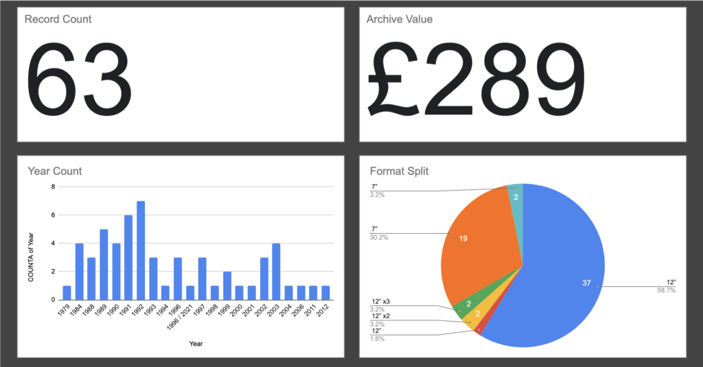

_ASOS Alumni on Make Life Work, tons of new vinyl for the Archive Collection, plenty live music at Dad Camp, Finsbury Park and Princess' performance, major milestone with a work project and a "quiet" week to myself._

## **Make**

- Released [Carlo Beschi](https://makelifeworkpodcast.com/carlo-beschi/), [Aj Wilson](https://makelifeworkpodcast.com/aj-wilson/), [Lewis Prescott](https://makelifeworkpodcast.com/lewis-prescott/) and [James Norton](https://makelifeworkpodcast.com/james-norton/)'s episodes of Make Life Work Season 9
- Blogged about my [Podcast Kit](http://sijobling.com/blog/podcast-kit-2022/) after a few conversations around a Twitter Community and [On The Side](http://ontheside.network)
- Outlined another Product On a Page about [creating event GIF's](http://sijobling.com/blog/pop-event-gifs/) based on calendar feeds for sharing on social networks
- Posted a ton of records from my birthday dig on [The Archive Collection](https://www.instagram.com/the.archive.collection/) and created a dashboard based on release year, record format and archive value (some of the data is a bit dirty which needs attention)

- Renewed HouseFinesse.com and MakeLife.Work for another year as I try to reduce my (unused) domain portfolio, focusing on those that are actually used
- Enjoyed our first ever House Finesse group call with Disco77 and Black Dynamite, reminiscing over old tunes, moaning about modern music

## **Life**

- Great fun on our annual Dad Camp trip, this time with a full weekend of music cover acts including an epic Whitney Houston finale 
- Enjoyed my birthday off with a healthy swim, record shop dig at Weedon Antique Village and cheeky lunch at Bacco Lounge
- Blown away by Princess' drumming debut performance at school, she's a natural!
- Saw George Ezra and friends at Finsbury Park with Princess and her BFF's family - great day out but hardly knew the support acts
- Smart ForFour died on the way back from a school play with the alternator failing us
- Finalised details for our Wedding Vows Renewal on our 17th anniversary next month
- Quiet week alone with the whole family holidaying on Essex coast, spending much of it listening to records 

## **Work**

- Released our first [ASOS Tech Podcast](https://www.google.com/url?sa=t&rct=j&q=&esrc=s&source=web&cd=&cad=rja&uact=8&ved=2ahUKEwiv3ry0sqv5AhXMVMAKHZ4OCGsQFnoECBAQAQ&url=https%3A%2F%2Fpodcasts.apple.com%2Fgb%2Fpodcast%2Fasos-tech-podcast%2Fid1635504159&usg=AOvVaw37sJx9-Xp3Bv1_UVQJX_eF) episode with Craig & Albino talking to Nat & Lewis about open source followed up by Emma's Day In The Life Of
- Fascinating workshop with other tech leaders understanding our personality types with the [Insights Discovery framework](https://www.insights.com/products/insights-discovery/) - turns out I'm [💚💛💙❤️](https://www.thecolourworks.com/insights-discovery-colour-types-guide/)
- Hired another software engineer into our Stock & Fulfilment team
- Had a coaching session with Jon, exploring how the GROW model can be useful
- Started line management of 3 new engineers after handover of 3 others to a new engineering manager
- Another great Lightning Talk from Lewis J about accepting Bitcoin with [BTC Pay](https://btcpayserver.org)
- Announced the Tech Podcast to all of engineering with some entertaining audiograms created in [Descript](https://www.descript.com/?lmref=ZzV-GA)
- Enjoyed Dawn's ADHD Tech Develops session followed by an impromptu session demonstrating how to publish podcast content in [Pinecast](http://pinecast.com)

## **Read**

- [Disrupted: Ludicrous Misadventures in the Tech Start-up Bubble](http://sijobling.com/aside/disrupted/)
- [GTD in 15 Minutes: A Pragmatic Guide to Getting Things Done](http://sijobling.com/aside/gtd-in-15-minutes/)
- [New Threat (The Survivors, #2)](http://sijobling.com/aside/new-threat/)
