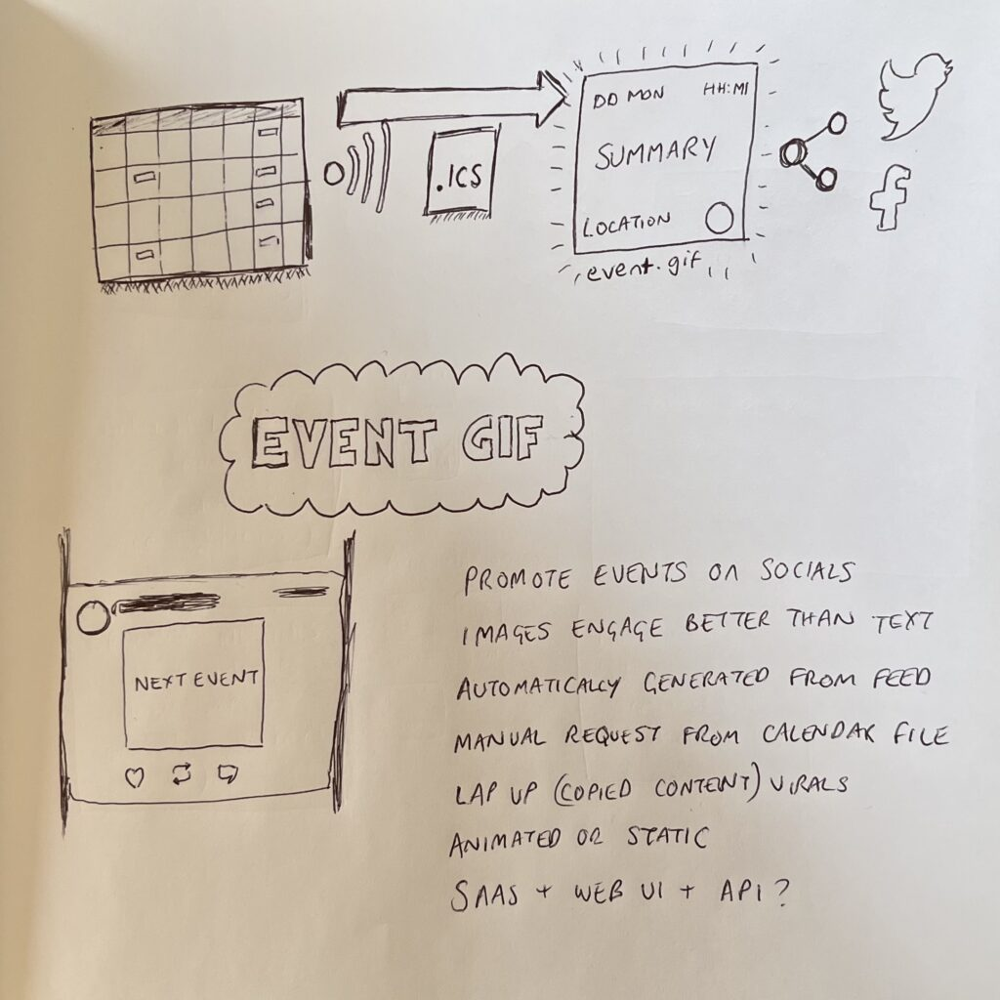

**For July’s Product On A Page, I started thinking about automatically generated images to promote calendar events.**

The idea came to me when I was looking at [Football Cal for this year’s World Cup in Qatar](http://footballcal.com/world-cup-2022) and how to share on the socials. We all know images and GIFs engage better than text plus it provides more opportunities for branded, impactful content beyond any character limits.

<figure>

<figcaption>

Event GIFs flow

</figcaption>

</figure>

Ideally, images can be automatically generated from an ICS calendar feed for simplicity but they could also be created manually or with another data source (JSON or XML). It could also be setup as an API that could integrate with automated services like IFTTT and Zapier.

Generated images can then be shared on social platforms like Twitter, Instagram, Facebook, Pinterest to promote calendar events across communities and wider audiences.
