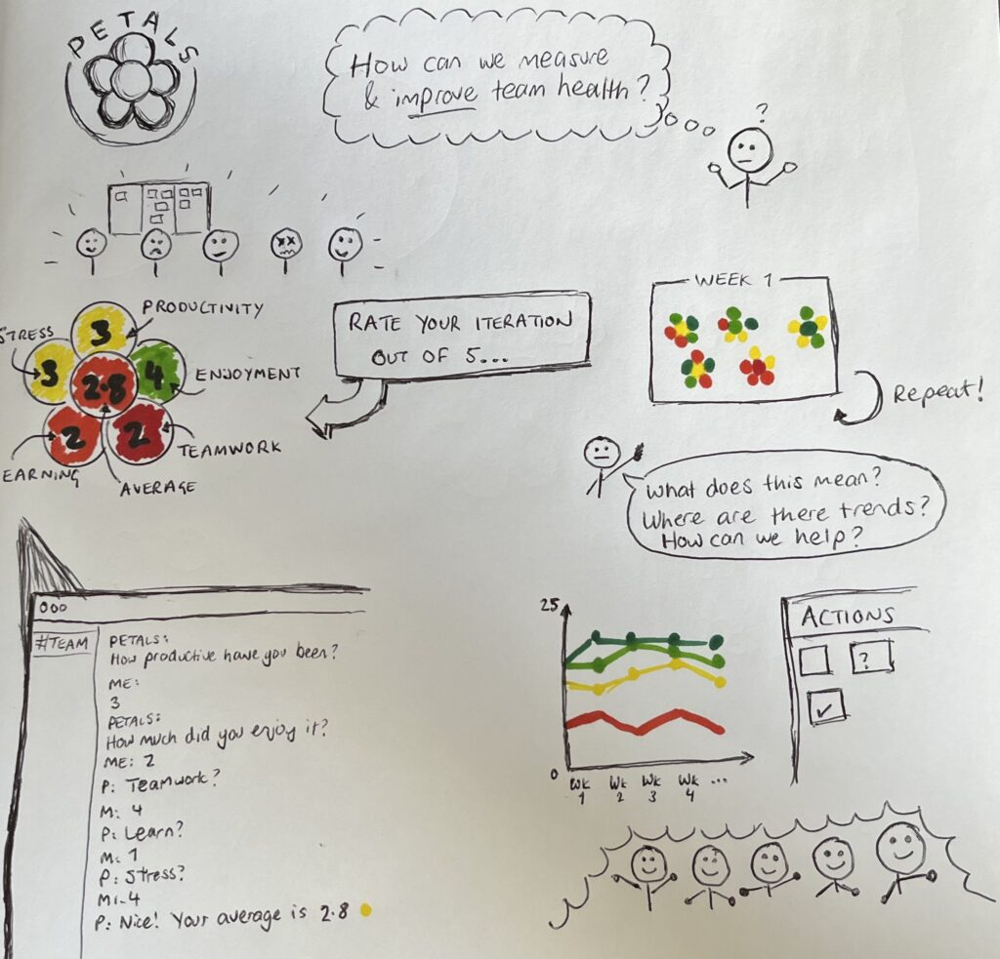

**How do you regularly check the health of your engineering teams? Here’s my Product On A Page for quickly and easily monitoring with PETALS.**

There are many frameworks and models out there to help track and improve team health. Some can be quite versatile and complex too but I’m keen to try a simpler mechanism for more consistent, faster feedback.

This model focuses on 5 key metrics:

- **Productivity**
- **Enjoyment**
- **Teamwork**
- **Learning**
- **Stress**

Each metric is rated out of 5 which can then provide an **AVERAGE** score overall, creating the acronym **PETALS**.

Ideally, this score is quickly captured every week for more faster feedback but teams could use two-week sprint cycles as an iteration or even monthly/quarterly checkpoints (not recommended).

As scores are captured by groups of people, trends and outliers can start to be observed, anonymously or known. This would ideally be with teams directly but also as leaders too. By monitoring individual metrics, teams could try to create actions through continuous improvement and retrospectives.

Groups of PETALS form bunches of flowers, creating a delightfully visual indicator for easily highlighting team’s health. Numbers then correlate to colour palettes that can be customised or, for convenience, use a familiar Red-Amber-Green traffic light system (1 is red, 3 is amber, 5 is green) that is recognisable to most.

Over time, we should start to see improvements or, in the case of noticing concerns, acted on sooner rather than later.

I like the idea of using a convenient engineering comms tool such as Slack or Teams bots in a group channel. This can be configured for preferred cycle times (e.g. Friday lunch, end of sprint) then compiled into snapshot reports for individuals or teams. Data can also be exported for team reports, leaders and coaches.
