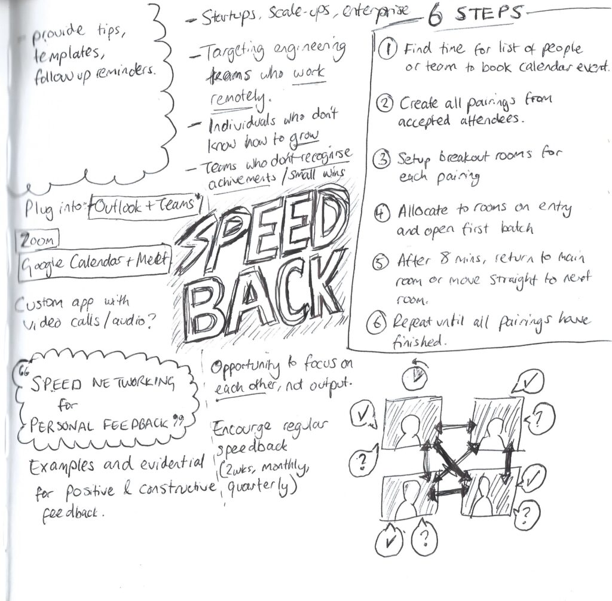

I recently heard on a podcast (citation needed) the idea of regularly creating a "product on a page" to keep creative juices flowing. This concept resonated with me as I've found my current role being people-focused doesn't allow as much creativity when working in tech. So I thought I'd give it a go.

Every month, I've got a Ticktick reminder to scribble down a **Product On a Page** (POP), no matter how far-fetched, stupid or brilliant it might be. As long as it's away from a screen with pen(cil) in hand, throwing down ideas visually, it's valid. For full accountability, I'll also share them on my blog and socials which might prompt further developments and interactions.

This first one is an elaboration on a recent blog post I wrote about facilitating faster feedback between team mates in a speed-networking environment called [Speedback](http://sijobling.com/blog/speedback/). Through running these sessions manually, it got me wondering how it could be made easier through some automation in MS Teams (other video conference software is available).

<figure>

<figcaption>

Speedback concept using automation with existing video call tools

</figcaption>

</figure>

On reflection, you can see this is quite a word-heavy scribble, not many visuals, something I'd like to improve through this ongoing exercise.

I'd also love to build something out of this but it will definitely need some support from engineers who have third-party API experience, ideally on [Zoom](https://capitaloneshopping.com/s/zoom.us/coupon), Office365 or Google Workspace.

What do you think? Would you like to join me in this exercise? Are there any other exercises you personally try to nurture creativity? Share with us.
