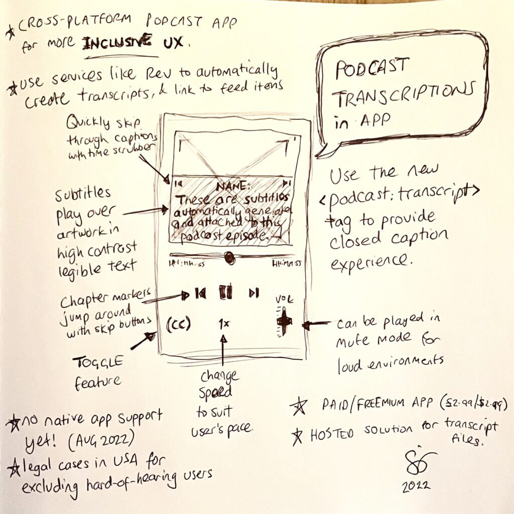

**This month, I got thinking about how to embed transcriptions into podcast episodes that are then displayed to users.**

Coincidentally, the [latest podcast specification](https://github.com/Podcastindex-org/podcast-namespace/blob/main/docs/1.0.md) now includes a `<podcast:transcript>` element for each podcast item. This takes a standard CRT transcription file URL which can then provide closed caption subtitles at appropriate timestamps.

None of the existing native podcast apps I’ve tested support this yet but Blubrry have rolled out an update to their web player which does.

<figure>

<figcaption>

Transcription podcast player Product On a Page

</figcaption>

</figure>

My product design displays subtitles over the artwork with additional functionality to bring subtitles to the core user experience such as quick navigation, speed and volume levels.

Subtitle displays can be customised for high contrast, inverted colours, dyslexia friendly, colour blindness and a number of other default favourites along with personalised preferences.

Transcriptions can either be manually curated or automatically generated using services like Rev or Descript then applied locally, through cloud storage or feed item settings.

Ideally, this would be a cross platform native app experience to leverage other device APIs and functionality. From my experience, iOS and Apple are more popular with Spotify quite close behind so initial focus would be on the Apple ecosystem. Web alternative could bring some interesting device parity but with some browser API limitations.
