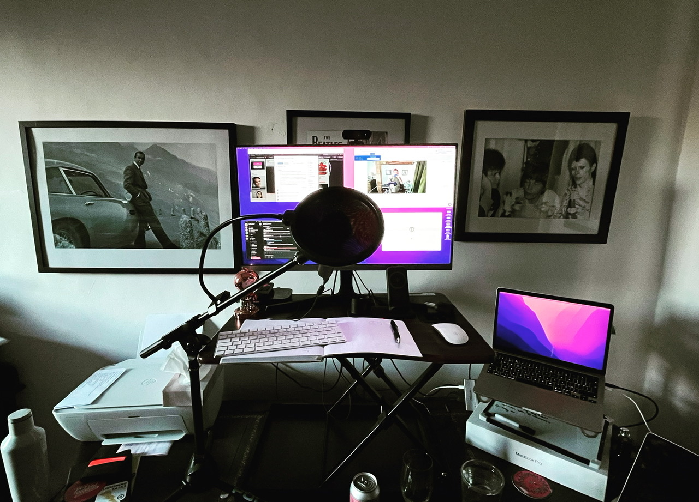
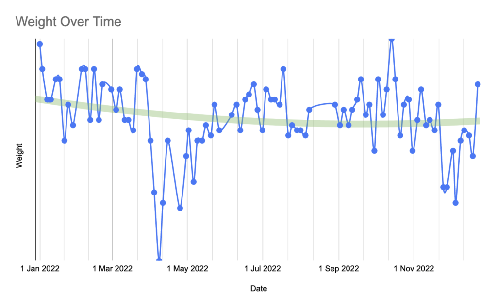

Rather than look back at 2022 with the typical long read, I thought I’d try something a little different this time by pulling out some key metrics I’ve been compiling from life tracking on my Personal Dashboard. Let’s see how this goes…

## Podcasting

#### 2,256 Make Life Work downloads

5x S08 + 6x S09 episodes

39 followers (+3)

#### 722 House Finesse fans (+25)

8 mixes + 29 residencies + 7 guests

53k downloads

## **2,256** Make Life Work downloads

5x Season 8 + 6x Season 9 episodes

39 followers (+3 on 2022)

* * *

## Other Sides

#### 83 records in The Archive Collection

66x 12" + 9x 7" + 7x albums

#### £625 on side projects

£302 hosting + £109 domains + £163 tools + £51 MP3s

* * *

## Health

**76.9kg** average weight (4.3kg variance)

**97 workouts** (-6 on 2021)

**15 workouts** in March

**2,817 pushups** in November (126 on 22 Nov)

* * *

## Work & Productivity

#### 31 office visits

26 trips to London, 5 to Birmingham

#### +5 engineers across 5 teams

7 new recruits, 2 leavers & 3 promotions

|  | Trello Work | Ticktick   Personal |
| --- | --- | --- |
| Completed | 2,314 | 2,333 |
| Daily Average | 10.61 | 6.48 |
| Most Productive Day | 22 | 20 |
| Most Productive Month | September (234) | November (502) |

* * *

## Enjoyment

#### 52 movies watched

_(on Letterboxd)_

#### 45 books read

_(on Goodreads)_

#### 93 beers recorded

_(on Untappd)_
