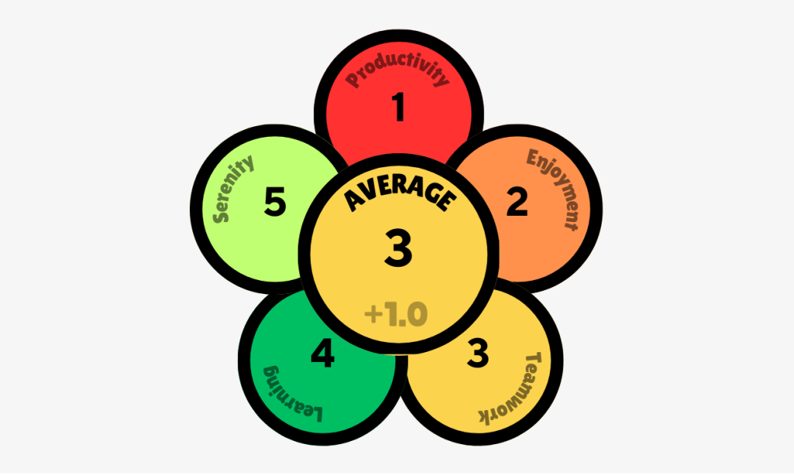
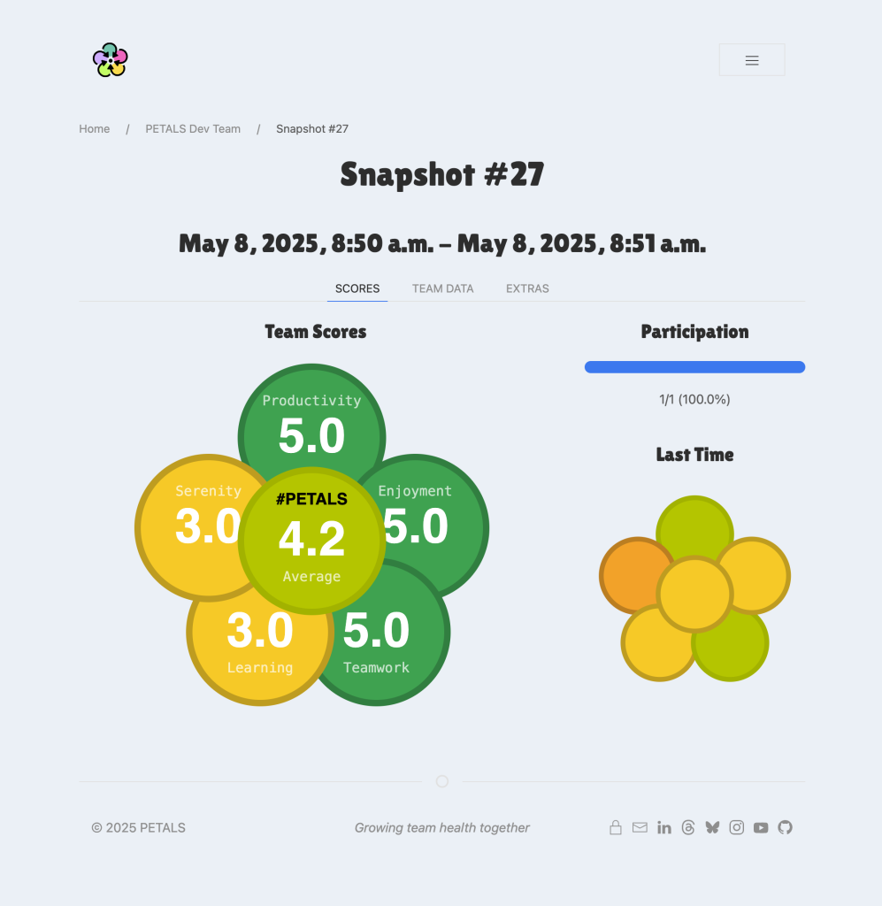

There’s a lot of talk about team health these days: retros, wellbeing check-ins, pulse surveys, the works. But in reality, many teams still struggle to _see_ what’s going on until it’s too late. Or worse, they see it but don’t know what to do about it.

This post isn’t just a product update. It’s a reflection on what I’ve been building recently — tools that aim to make team health feel more _visible_, _usable_, and _actionable_. It’s also a bit of a love letter to side projects, collaboration, and the joy of making things that actually help people work better together.

Over the past few months, I’ve been focusing on two key projects:

- A complete rebuild of our [**PETALS**](https://petals.team/) app, my lightweight framework for measuring and talking about team health

- A new internal app, co-built with one of my engineers, that helps turn raw feedback into something constructive using generative AI

Here’s how those projects have come together — the thinking, the tech, and what I’ve learnt along the way.

## Rebuilding PETALS from a spreadsheet hack to proper app

[PETALS](https://petals.team/) has been my go-to framework for checking in on how teams are really doing. It’s light-touch and people-first, asking teams to score five areas regularly:

<figure>

<figcaption>

Rate your flower on productivity, enjoyment, teamwork, learning and serenity to get an average

</figcaption>

</figure>

The original version was held together with Google Forms, hand-crafted charts, and a spreadsheet full of fragile formulas. It did the job (just) but wasn’t something I could confidently roll out across multiple teams or organisations.

So we rebuilt it from the ground up, with two key goals:

1. Make it easier for teams to submit and view their scores

3. Turn those scores into something teams can actually use to reflect and adapt

The very first prototype we threw together last year used a clunky UI framework that didn’t scale well and wasn’t easy to work with — but it let us move fast, test ideas, and iterate on a super simple foundation. It served its purpose, but I was always hesitant to promote it more widely. I wasn’t happy with the aesthetics (it definitely wasn’t my finest), and I’m always conscious of how important first impressions are, especially when you’re building something that’s meant to feel supportive and thoughtful for professional teams in businesses.

So this time, we kept things lean but focused. The new app runs on Python/Django, hosted on [**Heroku**](https://www.heroku.com/), with a PostgreSQL backend. The UI is built with [**UIkit**](https://getuikit.com/), chosen for its simplicity and speed. GitHub handles pull requests, a Heroku pipeline to automatically deploy from our `staging` and `main` branches safely and accordingly.

It’s been great fun getting properly back into web development after mostly being a tech leader for the past eight years. I’ve always chipped away at side projects (like all my sports calendars), but those were usually based on old frameworks with minimal interactivity.

This build has been a lot more detailed. I’ve learnt loads with Python and Django, and dusted off my front-end skills to make the UI clean and usable, while still keeping an eye on the important _“-ilities”_ like accessibility, reusability, and maintainability.

I’ve also really enjoyed collaborating with other techies again. It’s been a genuine highlight getting back into regular Dev Time with [**Brian Suda**](https://suda.co.uk/), who I’ve worked with on and off since the noughties and still rate as one of the best engineers I know. And it’s been brilliant having [**Adrian Lansdown**](https://www.adrianlansdown.com/) on the project too - an old friend and recent colleague who’s brought fresh ideas, skills, and energy to the mix.

The result? The [**app is now live**](https://app.petals.team/account/login?next=/), with a couple of teams actively using it in the real world, and we’re already getting positive and useful feedback. It’s not just a nicer form anymore; it’s a tool that encourages better conversations and helps teams see patterns in how they’re working and feeling over time.

## Feedback is hard. AI can help (sometimes)

More recently, I’ve started working on a small AI bot with one of my engineers for providing constructive feedback to your peers.

We all know feedback can be tough. Especially when it’s constructive, emotional, or poorly timed. People often hold back or water it down, or it lands wrong and makes things worse. So we wanted to explore whether AI could help reframe difficult feedback into something more useful and respectful.

The tool is simple:

1. You write what you _really_ think

3. It rewrites the message using an LLM prompt to make it more thoughtful, constructive and respectful of your environment

5. You choose to share directly, send it via message, tweak or even bin it entirely

For example, if you write:

> “They always take over meetings.”

…it might suggest:

> “You have a strong presence in meetings — could you help create more space for others to contribute?”

The aim isn’t to sugar-coat the message, just to help people express themselves more clearly, especially when emotions are high. We’re testing it ourselves first, both as team members and leaders, and it’s already helping us pause, reflect, and phrase things with a bit more care.

We’ve kept it intentionally small for now. But it’s an interesting experiment in how internal tools (even simple ones) can support better communication and psychological safety.

## Some reflective wisdom

These projects aren’t perfect, and they’re not done. But they’ve already reminded me of a few important things:

1. **Side projects are culture tools.** Especially when you’re building with your own team, for your own team.

3. **Design still matters.** Taking time to make things usable and enjoyable is worth the extra effort.

5. **Feedback needs help.** Tools can’t fix culture, but they can lower the friction just enough to spark better habits.

7. **Collaboration energises.** Working with people like Brian and Adrian has brought fresh momentum and ideas I wouldn’t have come up with alone, the same goes for our internal AI bot.

9. **We work in tech: we should use our skills to make our jobs better.** There’s a lot of talk about team culture, feedback loops, and ways of working, but it’s even more powerful when we _build_ tools that support those conversations. We should practise what we preach and use our own craft to shape how we work.

There’s also a lot of noise (and fear) around AI taking over our jobs. I don’t see it that way. I’ve been embracing AI to _assist_ me, not _replace_ me. It helps me write, reflect, and generate ideas faster (I even used ChatGPT to draft up this blog post which gave me a great skeleton straight away that I spent about an hour making my own).

But the core ideas? The intent, the shape, the human edge: that still comes from me. AI can support the work, but it’s our _human creativity and care_ that drives it. I can’t see AI replacing that any time soon. Mr Altman even admitted this in a recent TED conversation:

https://www.youtube.com/live/5MWT\_doo68k?si=bC6XyzeQ7uTVRYD3

## What's next?

We’ll keep shaping [our PETALS app](https://app.petals.team/) based on user feedback and explore ways to integrate the feedback tool into other flows, ideally a Slack bot!

And as always, we’ll keep experimenting with small tools that nudge better behaviours in our teams.

If you’re working on something similar, or want to borrow some of this thinking for your own team, [reach out](https://sijobling.com/contact/). I’d love to chat.
