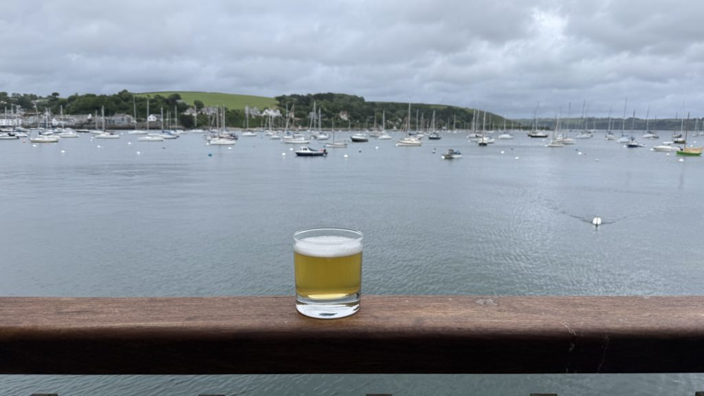
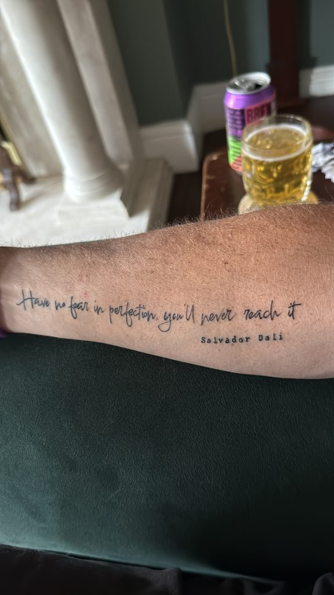
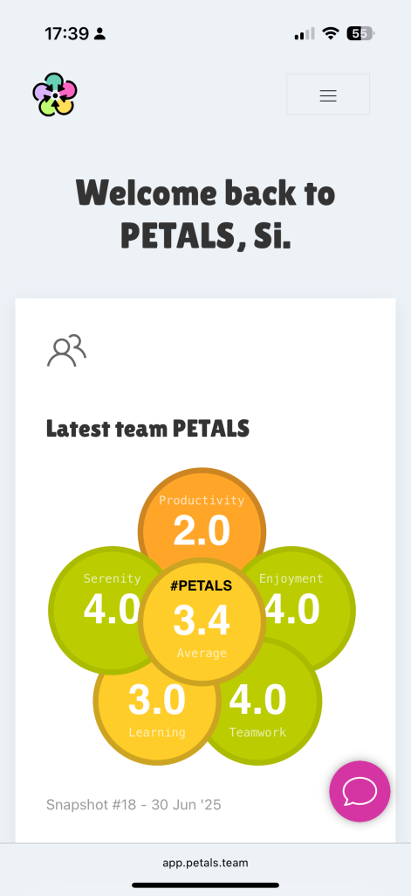
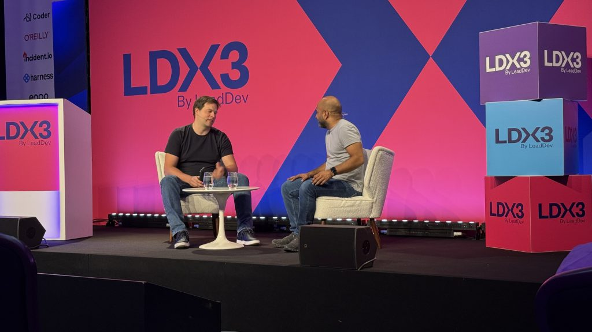
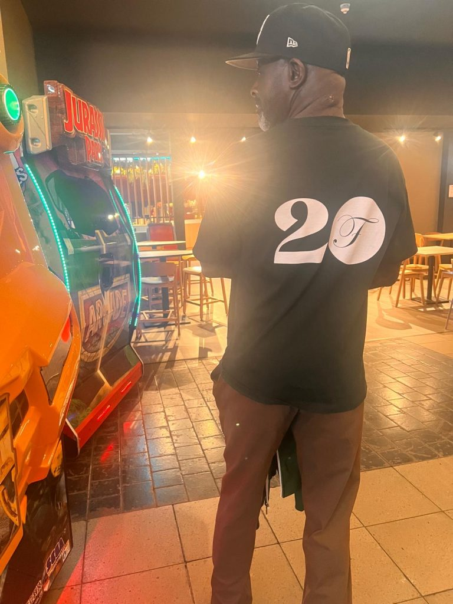
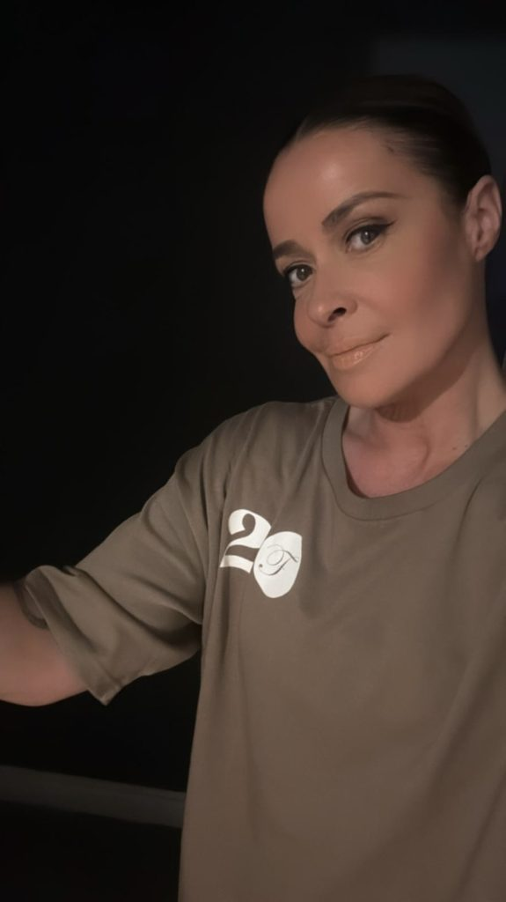
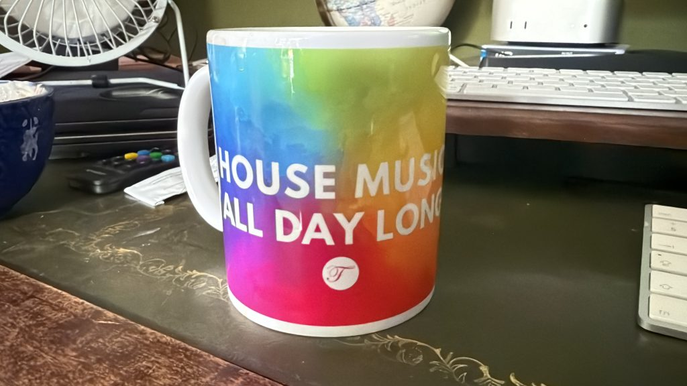

It’s been a full-on few months. Between building products, running teams, raising money, and squeezing in the odd tattoo, here’s a look back at what’s been going on from April to June 2025.

### **A much-needed break in Cornwall**

After a pretty intense first half of the year, I finally took some time out for the late-May Bank Holiday. We headed down to Falmouth, Cornwall, staying in a family holiday home right on the coast. Stunning views, sea air, and plenty of places to unwind.

Caught up with family, tried all the local food & coffee places, and on the final day… got tattoos. Mine is a quote by Salvador Dali:

> _“Have no fear of perfection, you’ll never reach it.”_

Felt like quite a powerful and relevant message considering my mindset and career.

**Pro tip:** Spread your holidays out across the year. It helps you reset more often and keeps the burnout at bay.

### **The PETALS app is finally live!**

After years of prototypes and plenty of late-night building sessions, we finally launched the [PETALS app](http://app.petals.team) in May. A proper working product, now in the hands of real teams.

- Simple, lightweight team health check-in tool

- Charts, visuals, and rapid feedback mechanisms to streamline team reflections

- Designed to spark meaningful conversations in minutes

**Massive shout-out to [Brian](http://suda.co.uk) and [Adrian](http://adrianlansdown.com)** who helped to make it happen. They've built features, squashed some bugs, and sanity-checked everything I was second-guessing. More than anything, they were brilliant accountability partners, proving how much a healthy team attitude matters when trying to ship something great. Our weekly Friday lunch checkpoints to talk through progress and challenges have been a huge help, as has the async Slack chats to keep ideas flowing in between.

We’ve got a handful of companies actively using it now which is a promising start, but we really want to scale things up in Q3 and Q4. The more teams we reach, the better the feedback and more useful data for shaping what comes next.

I also took some (new) stickers and promo codes to LDX3 hoping to build buzz with the ideal target audience, and while they looked the part, not much came from it. The old saying _“Build it and they’ll come”_ really isn’t true as it used to be.

So the next focus is on creating awareness. We’re experimenting with fresh ways to demo PETALS through all our social channels, showing off its simplicity and potential in a way that actually sticks. Watch this space.

### **Industry vibes & reality checks** at **LDX3**

In mid-June, I headed to one of the biggest conferences in the tech leadership industry, LDX3 in London (formerly known as LeadDev) to see what the rest of the industry is talking about.

_TL;DR:_ We’re mostly aligned with modern leadership and engineering practices in my experience, both present and past. _But_ there’s still a long way to go to reach the high performance or some of the biggest international organisations.

For a fuller picture of key takeaways, I wrote up my [10 lessons learned from LDX3](https://sijobling.com/blog/10-takeaways-from-ldx3-2025/) with plenty in there about tech leadership, neurodiversity and AI.

### **House Finesse turns 20**

This year marks 20 years of my house music podcast, now known as [House Finesse](http://housefinesse.com).

Back in July 2005, I uploaded a recently recorded mix called [Funky Pants](https://housefinesse.com/onephatdj/funky-pants/) to my blog and tried submitting the RSS feed to Apple iTunes podcast directory to see what happens. After numerous featured moments on their homepage and charts, it's continued to grow a loyal audience, changing shape over the years from the **One Phat DJ Podcast** to the **Funky House Finesse** radio show and now the **House Finesse** podcast which I run with an amazing group of DJ's from Colchester UK.

We've now kicked off celebrations with a [lush guest mix from Charlie Price](https://housefinesse.com/shows/hf274-with-charlie-price/), and we've got plenty more lined up through the summer.

In the mean time, I've also been exploring other ways to keep the community engaged with a brand new [WhatsApp community](http://housefinesse.com/whatsapp) for our listeners to interact with each other and the DJs and created some branded [20th anniversary merch](https://housefinesse.teemill.com/collection/20-years/) (caps, tees, mugs… mostly just adorned by me so far).

20 years on and we're still keeping it fresh with the latest and greatest house music on the scene _#housemusicalldaylong_

### **Other highlights from Q2**

- **21km for Dementia UK** – I ran my first ever half marathon distance (on a cross-trainer, don’t judge) and [raised £2,272 for Dementia UK](http://justgiving.com/page/21km-for-dementia)

- **Leading 4 teams at once** – I was responsible for looking after all four engineering teams in our Milton Keynes office while we backfilled another Engineering Manager position. Nearly 20 people, each with their own challenges and projects; a big stretch but loads learned.

- **Welcome back, old friend** – We brought in Neil Crosby, an old Yahoo mate from 2006-2007, to take over the two teams I was managing temporarily. Great to reconnect and see how much things have changed since the early dev days.

- **Agent mode with GitHub Copilot** – We ran a one-hour workshop in the MK office exploring GitHub Copilot Agent Mode. Not much was built, but the insight was gold; cynics found value, optimists were underwhelmed.

- **PETALS has been published twice** – old ASOS colleague Nic Brown and good old friend Paul D have recently included (decent) references to PETALS in their respective books, [Real World Agility](https://amzn.to/45RmP1x) and [Beyond The Wireframe](https://amzn.to/4nAMAcO), both published this quarter. It’s an honour to be referenced alongside other industry leading frameworks but also an amazing achievement from humble beginnings.

- **EURO 2025 calendar was built in 2 hours thanks to AI** – I created the full [EURO 2025 fixture calendar](http://footballcal.com/euro-2025) from scratch in under two hours. It was the first time I've properly used AI to build software; ChatGPT cleaned and verified the data, then Cursor generated the Markdown files. It's a fun little side project I continue to keep dabbling in as it scratches a personal itch and nice to see others benefit as well.

- **Jobling MP in the making** – The Boy ran as a paper candidate for the Green Party in our local elections this May, only to give people an alternative beyond the typical parties, but actually came out stronger than Labour.

- **Johnny Ball has still got it** – It was totally surreal to meet Johnny Ball (yes, _that_ Johnny Ball – aka Zoe Ball’s dad) at my wife’s school. At the impressive age of 85 years old, he gave a truly inspiring keynote to Year 8 Baccalaureate students but also kept all the parents and carers engaged too. Total legend.

- **Katherine Ryan at Utilita Arena** – We saw Katherine Ryan live in Birmingham, a Christmas present for Mrs J last year. She was hilarious, sharp, and absolutely nailed the second half with top-tier audience improv.

- **Lion, Witch and the Wardrobe at The Alex** – We also caught the stage version in Birmingham. It was sadly underwhelming though; decent concept but the delivery didn’t quite land.

- **Lone Wolf Comedy Festival Fail** – We tried to celebrate the boy finishing his A-Levels in May with a comedy festival in Bicester… but we never found it. Disappointing signage and terrible mobile searching didn't help but we ended up having a pint at "nearby" Diddly Squat Farm instead.

- **Great British Food Festival at Holdenby House** – Great day out with some friendly neighbours; delicious food, great music and entertainment, more sun than expected and maybe one drink too many. Definitely worth checking out if the tour swings by near you.

### **What's next in Q3?**

Here's some of my own goals I'll be working through the Summer months to keep me accountable and maybe get some help or ideas from anyone following along:

- Taking a **well-earned summer break**; 3 weeks in **Greece with the family** to celebrate our **20th wedding anniversary**, soak up some sun, and enjoy quality time before the boy heads off to uni in September

- Pushing more **PETALS publicity** across our social and community spaces with creative demos, clearer messaging, and a few fun surprises that might engage better than so far

- Build out the **PETALS Premium plan** with Brian and Adrian; extra functionality, deeper insights and richer multi-team support which add extra value to organisations who

- Start some **lightweight habit tracking** looking into my screen time, fitness activity, entertainment habits (Spotify, Plex and YouTube) and Duolingo progress. I’ve been gathering this data for _years_ through some IFTTT / Zapier integrations to Google Sheets and now the plan is to build a simple tool (maybe with some AI agents) to visualise, review and share regular progress. I'm also thinking of basing it on Mike Streety’s brilliant Statman app which he built last year and shared in our [On The Side community](https://sijobling.com/ontheside/). It could be the perfect springboard.
