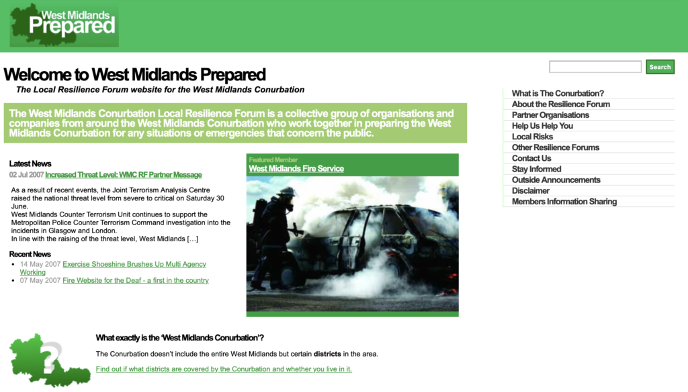
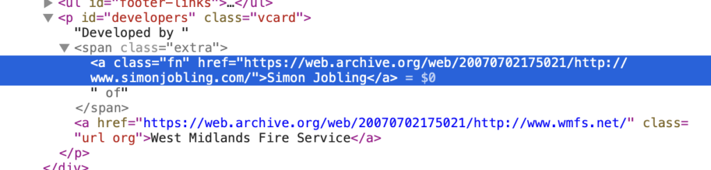

**One of the biggest projects I was fortunate to work on during my career at the West Midlands Fire Service was the West Midlands Prepared website, pulling together all the critical services from surrounding counties in case of any emergencies.**

The conurbation was established following the bird flu pandemic of 2006-7 where all emergency services, transport and utilities from surrounding districts came together to build connections and prepare the wider community for future incidents. There was a lot of shared responsibilities across the organisations and coordination through a number of channels and meetings.

The website was designed during the initial wave of Web Standards being established, so a responsive (liquid) design was adopted, making great use of groundbreaking CSS and design principles. We knew there would be a lot of information to share so a content first approach made sense, with clear and accessible content available to WCAG 2 standards.

It was built on a Wordpress fork for Java and hosted on-premise alongside other Fire Service systems. This allowed the content to be managed by all parties involved, and the template was easily updated using known frameworks.

As a Greenfield project, it was also a great opportunity to introduce some Microformats in the markup, enabling portable content to other standards, such as vcards for personal contact details.

This was my final project at the fire service before leaving for Yahoo! in June. It was a great legacy to leave behind, and a fantastic example of what could be achieved with modern standards in local government on such an impactful initiative.
