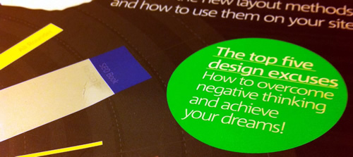

This month, [.net magazine](http://www.netmagazine.com/shop/magazines/april-2012-226) published my thought piece on No More Excuses.

There's a lot of creativity in the web industry, so many people with brilliant ideas, but we're all guilty of making excuses as to why we shouldn't make that website we've been mulling over for too long.

My intention was to address five popular excuses with suggestions on how to combat them.

1. _“It's been done before!”_
2. _“I haven't got the time!”_
3. _“There's too much to do!”_
4. _“I don't know where to start!”_
5. _“But nobody will use it!”_

During my time as a web professional, there have been a number of tools and techniques I've adopted to aid me in creating the many side projects I've built. From project management techniques to online tools, from calling on the active community for help to reusing available resources openly shared and distributed.

Ordinarily, I would just publish the content here but I'd prefer it if you just picked up a copy from your local newsagents ([or online](http://www.myfavouritemagazines.co.uk/design/net-magazine-back-issues/net-apr-12/ "Buy printed .net April 2012 for £5.99")) or [download a digital copy from Zinio](http://gb.zinio.com/browse/issues/index.jsp;jsessionid=BC3749D82BDB1711AEAE481EC1C76BCF.prd-main-news4?skuId=416212892 "Buy a digital copy of .net April 2012 for £4.16").

This article seemed like an ideal opportunity to gather all my thoughts and experience into a brief guide for others to take on with the intention of motivating others to cut out the excuses and start creating websites.

It was also my first official publication in the magazine. For years, I've considered writing for .net but, for one reason or another, I've put it off. What better motivation than to take inspiration from the topic and stop making excuses myself? Hopefully, this is the start of more frequent content. We'll see. It bodes well that it made the cover.

