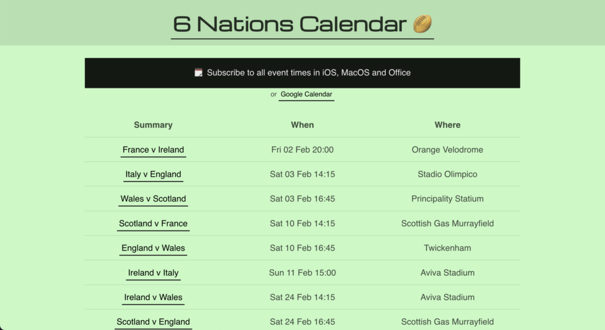

Following the series of sports calendar projects, [6 Nations Calendar](https://6nationscalendar.com/) provides all the kick off times for the annual 6 Nations competition directly on your own mobile or computer.

Built in just two evenings using frameworks I've developed in the past, this was a great example to demonstrate the value of reusing tech to get a simple idea live in a short time frame.

It's using the Sports Times Gatsby framework I created back in 2019 for other competitions and is still in use on [footballcal.com](http://footballcal.com) (which has been neglected since the Euro 2020 tournament). Due to the neglect, some of the code was outdated and required some updates, specifically on dependent Node packages.

I also realised the Moment.js library used to generate the ICS file introduced some breaking changes in that the date elements were now treated as integers instead of strings, plus the month value in the ICS library was offset by -1, which was identified in the user testing.

Visually, it's very simple - it's not my finest work but it's clean and useable so at least people can start using it. I changed the heading font to Michroma which is more modern than the previous Google Font used. The colour scheme has been lightened as well, plus the main call to action was made more evident with the full width solid background.

Being a very quick project, there's plenty enhancements I'd like to introduce but I can chip away at these through February and March as the competition continues. I've already received some suggestions and requests which will be implemented.
